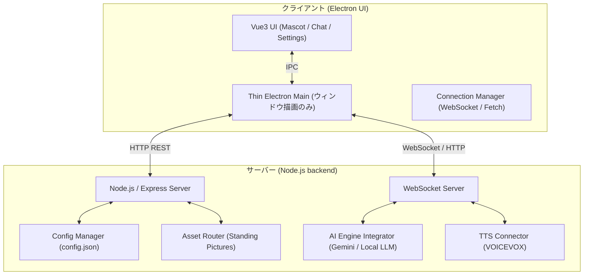

# 実装計画書: クライアント＆サーバ化 (Client-Server Architecture)

本計画書は、現在単一のデスクトップアプリケーション（Electron + Vue3）として密結合で動作しているデスクトップAIマスコットを、UI描画専用の「クライアント」と、AI推論・アセット・音声合成・設定を一元管理する「サーバー」へ分離するためのアーキテクチャ設計および移行ロードマップをまとめたものです。

---

## ユーザーレビュー要求事項

本実装は大規模なアーキテクチャの変更を伴うため、作業開始前に以下の点について合意を得たいと考えております。

> [!IMPORTANT]
> **通信プロトコルと技術選定について**
> リアルタイムな双方向通信（マスコットの感情変化、発話、アセットロード）と音声・画像データのストリーミングを考慮し、**「HTTP/REST API（静的アセット・設定用）」と「WebSocket（リアルタイム対話・イベント同期用）」のハイブリッド構成**を提案いたします。
> もし gRPC や他の通信規格のご希望がある場合はお知らせください。

> [!IMPORTANT]
> **サーバー側の技術スタックについて**
> 既存 of `electron/main.ts` に実装されているTypeScriptの資産（Gemini / LM Studio API連携、VOICEVOX連携、アセット管理ロジック）を最大限に流用するため、**サーバー側は「Node.js + Express + ws (WebSocket)」で動作する TypeScript サーバー**として構築することを提案します。

---

## 提案されるアーキテクチャ概要

### 構成図

---

## 提案される変更点

新しくトピックディレクトリ `docs/client_server_architecture/` を作成し、関連する実装計画・タスク管理・修正確認資料を格納します。

### [NEW] [client-server-architecture](file:///c:/workspace/workspace-win/DesktopAiMascot/docs/client_server_architecture)

#### [NEW] [implementation_plan.md](file:///c:/workspace/workspace-win/DesktopAiMascot/docs/client_server_architecture/implementation_plan.md)
* 本計画書。

#### [NEW] [task.md](file:///c:/workspace/workspace-win/DesktopAiMascot/docs/client_server_architecture/task.md)
* 開発フェーズごとの詳細ToDoタスク管理リスト。

#### [NEW] [walkthrough.md](file:///c:/workspace/workspace-win/DesktopAiMascot/docs/client_server_architecture/walkthrough.md)
* 実装完了後の検証結果・スクリーンショット等の記録資料。

---

## 段階的実装ロードマップ

### フェーズ 1: サーバーの基盤構築と接続UIの実装
1. **サーバープロジェクトの立ち上げ:**
   - プロジェクトルート配下に `server/` ディレクトリを作成。
   - `express` および `ws` を用いた TypeScript サーバーのスケルトンを構築。
2. **クライアント側の接続設定追加:**
   - クライアントの「設定画面」に、接続先サーバーのアドレス（IP/Port）を設定・検証できるUIを追加。
   - 接続ステータスインジケーターの実装。

### 2: 設定ファイルとアセット配信のサーバー移行
1. **設定管理 of 移行:**
   - クライアントローカルの `config.json` をサーバー側で一元管理するように変更。
   - HTTP API 経由で設定を取得・更新するエンドポイントを構築。
2. **アセット（立ち絵画像等）のストリーミング配信:**
   - `mascots/` フォルダをサーバー側に移行。
   - クライアントがサーバーから画像（DataURLまたは静的ファイルサーブ）を動的にロードする仕組みを実装。

### フェーズ 3: チャット・発話・感情制御の通信化 (WebSocket化)
1. **WebSocketサーバーの実装:**
   - サーバー側に双方向のリアルタイム通信用 WebSocket サーバーを統合。
2. **対話および音声合成処理の完全サーバー化:**
   - クライアントからのテキスト送信を受け取り、サーバー側で Gemini や LM Studio に問い合わせ。
   - 生成されたテキストからサーバー側で VOICEVOX を叩き、音声（Base64/Binary）とアニメーション制御用の感情タグをパースしてクライアントにリアルタイム送信。
   - クライアントはそれを受信して再生・感情適用するだけの「受信端末」に特化。

### フェーズ 4: クライアントプロセスの極限軽量化と最適化
1. **メインプロセスの軽量化:**
   - `electron/main.ts` から不要になった通信系 IPC ハンドラー（`ask-gemini`, `synthesize-voicevox` 等）をすべて撤去し、ウィンドウ表示管理にのみ特化させる。
2. **マルチクライアント接続確認:**
   - サーバーを起動した状態で、複数のクライアントウィンドウ（またはブラウザ）が同時接続しても、それぞれに独立した対話コンテキストが維持されることを検証。

---

## 検証・テスト計画

### 自動テスト (テストコード)
* サーバー側の API エンドポイント（HTTPおよびWebSocket）に対する統合ユニットテストの実装（Vitest または Jest）。
* 設定ファイルの読み書き・整合性バリデーションテスト。

### 手動検証
1. **動作比較検証:**
   - クライアント・サーバ構成時における、マスコットのアニメーション追従、音声発話の遅延（レイテンシー）が許容範囲内であることの確認。
2. **ネットワーク接続テスト:**
   - サーバーをローカルの別のPC（または仮想環境）で立ち上げ、クライアント側からネットワーク越しにIP指定でマスコットが100%完全動作することの確認。
