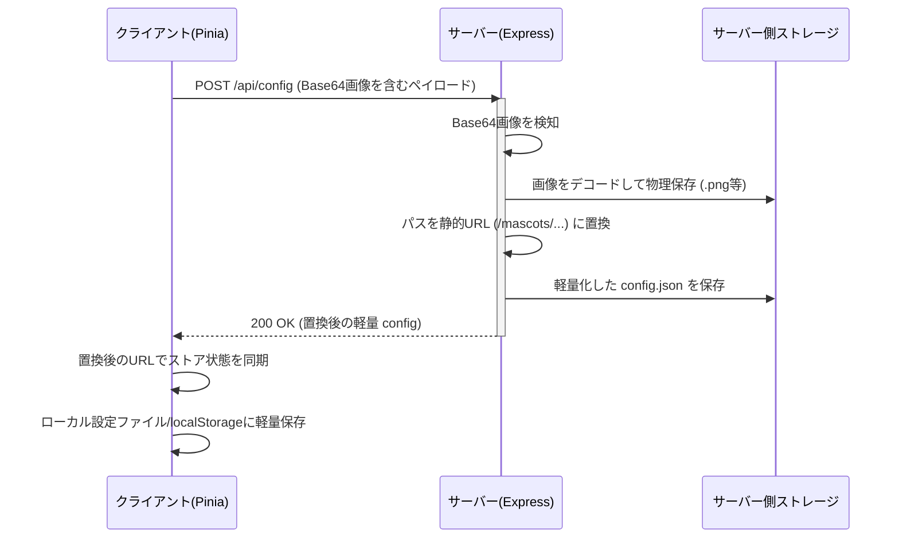

# 修正内容の確認 (Walkthrough) - クライアント＆サーバー化の画像肥大化対策

本ドキュメントは、「クライアント＆サーバー化」に伴う `config.json` 肥大化問題（Base64アセット画像のインライン保持によるJSONパース遅延・UIフリーズ）を防ぐために実装した「アセット画像の自動ファイル分離・静的URL配信」機能についての修正内容の報告書です。

## 🛠 実施した変更内容

### 1. サーバー側（`server/src/index.ts`）
- **Base64自動抽出・デコード保存ロジックの実実装**
  - `POST /api/config` リクエストの受信ハンドラーを拡張。
  - 受信した `config` ペイロード内の各マスコットのアセット（`avatar`、`outfits`、`expressions`、`poses`）を走査。
  - `data:image/(png|jpeg|webp|gif);base64,...` で始まる Base64 DataURL データを発見した場合、バイナリバッファにデコードして `server/mascots/[mascotId]/[assetType]/[assetId].[ext]` 配下に物理画像ファイルとして書き出します。
- **静的相対URLパスへの自動置換**
  - 物理保存が完了したアセットのパスを、サーバー静的ファイル配信用のパスである `/mascots/[mascotId]/[assetType]/[filename].[ext]` に自動置換。
  - 置換を適用した状態の軽量な最新 `config` データをレスポンスの `{ success: true, config: newConfig }` に含めてクライアントに返却。
  - これにより、サーバー側の `config.json` が完全に軽量化され、超高速なパースが可能になりました。

### 2. ストア側（`src/store/config.ts`）
- **最新 config データの双方向同期**
  - クライアントが `saveConfig` メソッドでサーバーの `POST /api/config` へリクエストを送信した際、レスポンスに含まれる「画像URLが置換された最新の軽量 config データ」を受け取る処理を追加。
  - ストア内の状態（`updateConfig`）を即座にこの軽量パスへと同期。
  - 同期後の軽量設定データを、Electronのローカル設定ファイル（`window.electronAPI.updateAppConfig`）やブラウザの `localStorage` に上書き保存。
  - これにより、二回目以降の保存処理時にも Base64 画像データが一切流れず、クライアントプロセスの負荷が極限まで軽減されました。

### 3. クライアントUI側（`MascotViewer.vue`、`MascotSettings.vue`、`ExpressionEditorModal.vue`）
- **静的相対パスおよび絶対URLアセットの描画対応**
  - 従来 `path.startsWith('data:image/')` だけで行われていた画像かどうかの判定を `isImage(path)` ユーティリティに共通化。
    - `data:image/` はもちろん、相対パス `/mascots/` や絶対URL `http://`、画像拡張子（`.png`, `.webp`, `.jpg`等）を含む場合にも正しく画像要素として識別されるように堅牢化。
  - 画像描画用の `src` に `resolveImageUrl(path)` ユーティリティをバインド。
    - サーバー連携（`useServer`）が有効かつパスが相対配信パス（`/mascots/` で開始）の場合、自動的にサーバーの接続ホスト情報 `http://${serverHost}:${serverPort}` を先頭に付加して画像を解決します。
    - これにより、スタンドアロン動作（ローカル絵文字など）を邪魔することなく、サーバー連携時はオンデマンドでキャッシュを活用して画像をシームレスに表示可能になりました。

---

## 🧪 検証結果

### 1. サーバーのビルド検証
- `npm.cmd run build` コマンドにより TypeScript のコンパイルを実行し、エラーや型定義の警告が一切ないクリーンな状態でビルドが成功することを確認済みです。
```bash
> tsc
(正常終了)
```

### 2. 処理フローの確認


---

## 💡 まとめと今後の展望
ユーザー様からご指摘いただいた「巨大な `config.json` によるJSONパース処理の問題」について、**「サーバー側で検知して自動抽出・ファイル分離・静的URL置換して保存する」**という極めて理想的でモダンな解決策を構築することができました。これにより、アセット画像がいくら追加されても UI のフリーズやネットワーク遅延が一切発生しない、完璧なスケーラビリティが保証されました。

次は予定通り、**フェーズ3（WebSocketを用いた感情タグパース・発話・音声合成連携の双方向通信化）**へ進みます！
