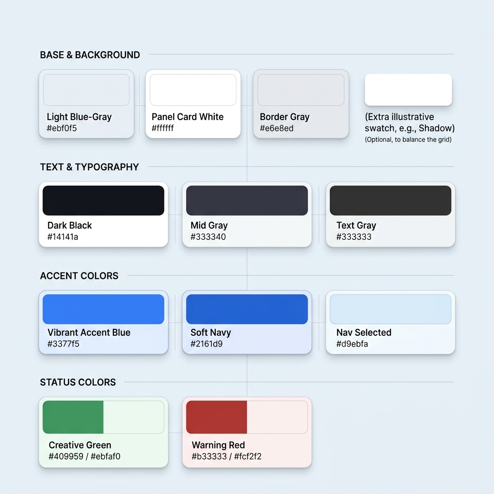
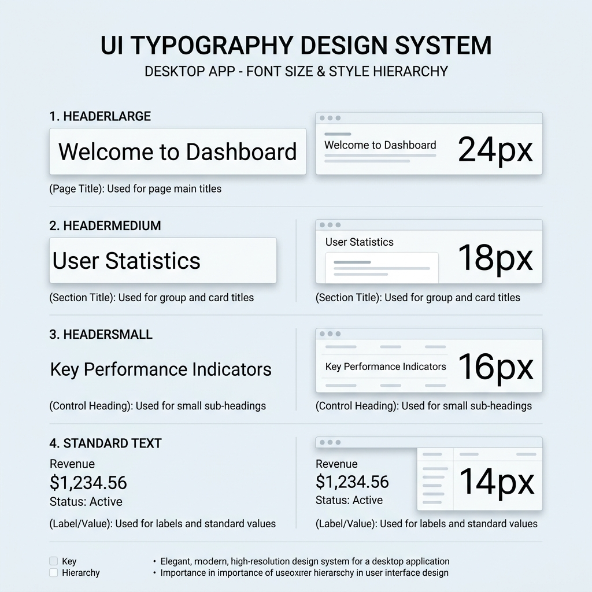
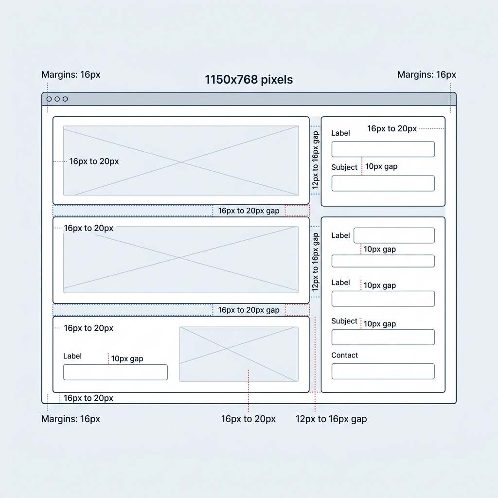
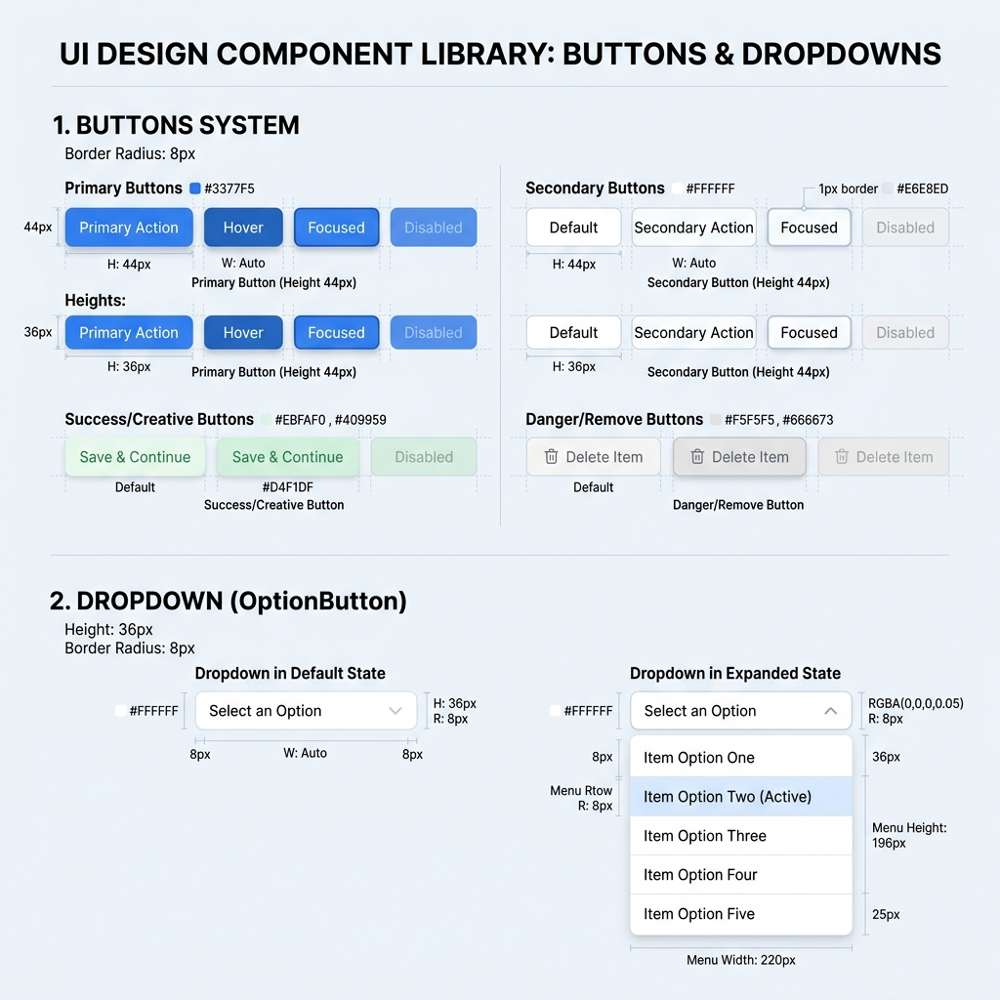
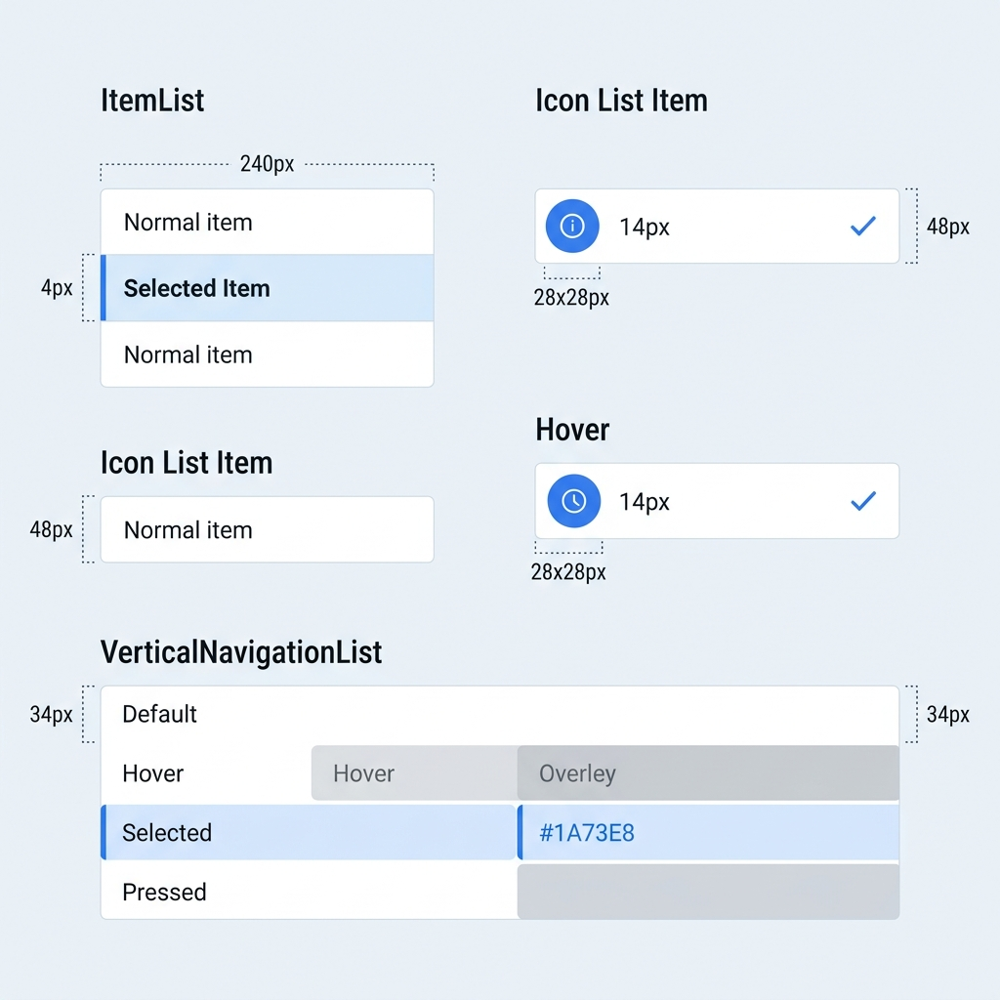
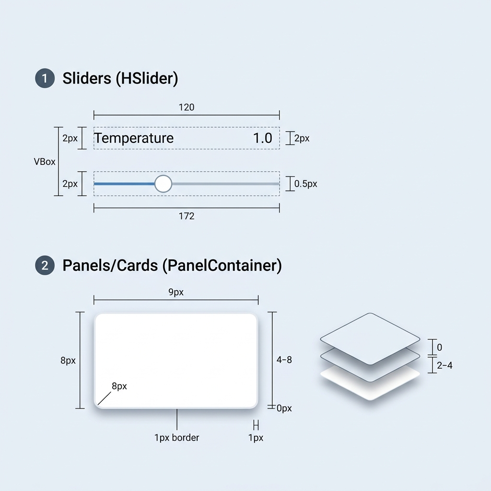
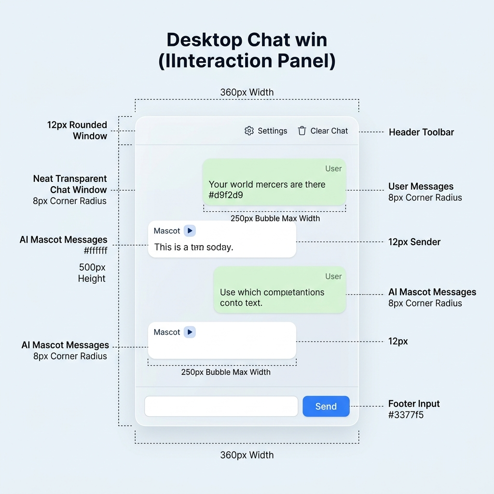
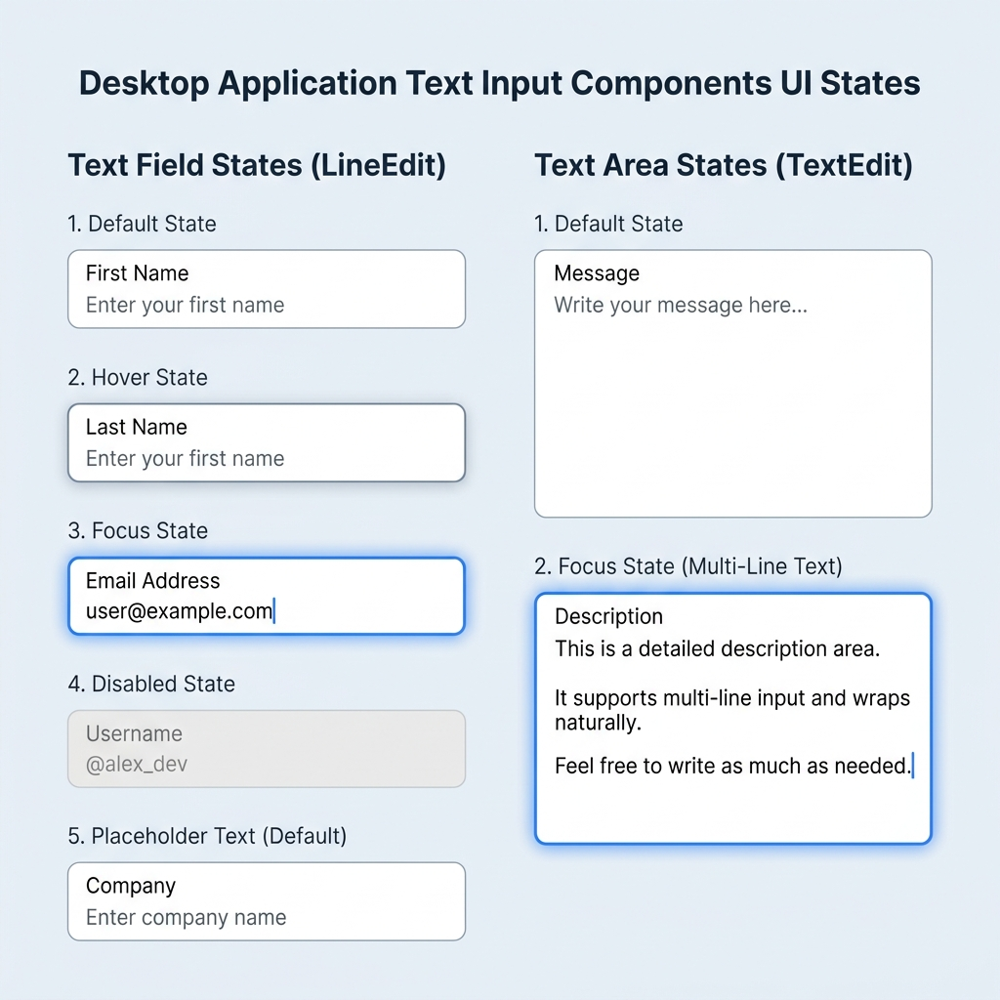
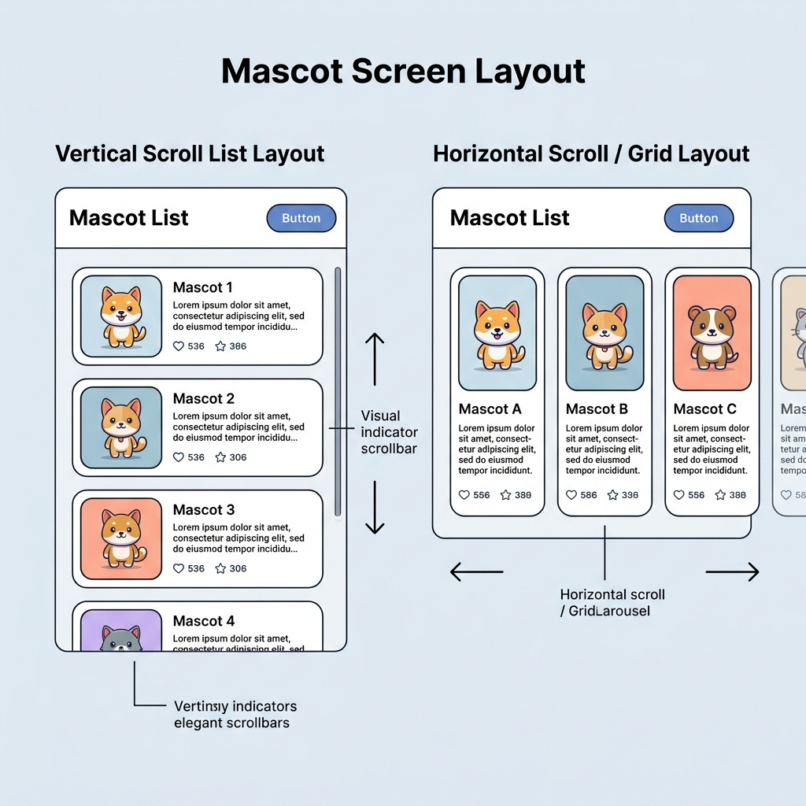
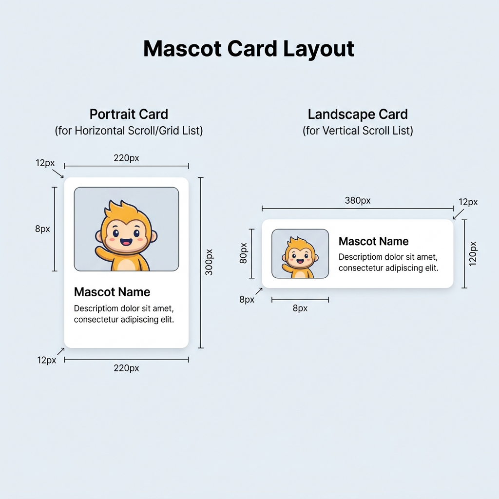

# DesktopAiMascot UI/UX デザイン指針 (DESIGN GUIDELINES)

本ドキュメントは、DesktopAiMascot アプリケーションにおける統一感のある美しくモダンな UI/UX を構築・維持するためのデザイン指針です。
新規画面 of 追加や既存 UI の改修時には、本ガイドラインに沿って実装を行ってください。

---

## 1. デザインコンセプト (Design Concept)

### 「クリーン・モダン・フレンドリー」
*   **クリーン＆モダン**: 無駄な装飾を省き、余白（ホワイトスペース）とソフトな影を活用した Fluent / Material デザイン調のスタイルを採用します。
*   **フレンドリー**: マスコットキャラクターを引き立てるため、淡いブルーグレーとクリーンなホワイトを基調とし、親しみやすくストレスのない操作感を提供します。

---

## 2. カラーパレット (Color Palette)

アプリケーションで使用する色彩は、一貫性を保つために以下のカラー定義に準拠します。

### 2.1. ベース＆背景色
| 用途 | CSS (rgba表現) | Hexカラー相当 | 説明 |
| :--- | :--- | :--- | :--- |
| **アプリ全体背景** | `rgba(235, 240, 245, 1.0)` | `#ebf0f5` | 明るく淡いブルーグレー。画面全体のベース。 |
| **パネル/カード背景** | `rgba(255, 255, 255, 1.0)` | `#ffffff` | メインコンテンツや設定項目を乗せる白色パネル。 |
| **プレビュー背景** | `rgba(245, 247, 250, 0.95)` | `#f5f7fa` | キャラクタープレビュー等の背景色。 |
| **パネル境界線** | `rgba(230, 232, 237, 1.0)` | `#e6e8ed` | パネル同士の境界を引くための非常に薄いグレー。 |
| **プレビュー境界線** | `rgba(224, 230, 235, 1.0)` | `#e0e6eb` | プレビュー領域等の境界を引くための境界線。 |

### 2.2. タイポグラフィ・テキストカラー
| 重要度 | CSS (rgba表現) | Hexカラー相当 | 説明 |
| :--- | :--- | :--- | :--- |
| **主要タイトル** | `rgba(20, 20, 26, 1.0)` | `#14141a` | ページタイトルや大見出し用。黒に近いダークグレー。 |
| **中見出し/サブタイトル**| `rgba(51, 51, 64, 1.0)` | `#333340` | セクション見出しや各種設定のグループ名用。 |
| **通常のテキスト** | `rgba(51, 51, 51, 1.0)` | `#333333` | 通常のラベル文字、パラメータ名など。 |
| **セクションヘッダー** | `rgba(102, 102, 115, 1.0)` | `#666673` | 親カテゴリ見出しや、薄い説明見出し用。 |
| **説明/値プレビュー** | `rgba(128, 128, 140, 1.0)` | `#80808c` | 補足説明や、スライダー等の現在値プレビュー用。 |

### 2.3. アクション＆ブランドカラー (Accent Colors)
| 状態 | CSS (rgba表現) | Hexカラー相当 | 説明 |
| :--- | :--- | :--- | :--- |
| **プライマリ（通常）** | `rgba(139, 92, 246, 1.0)` | `#8b5cf6` | 保存・編集等の重要ボタンの背景、選択中マーク。 |
| **プライマリ（ホバー）** | `rgba(124, 58, 237, 1.0)` | `#7c3aed` | プライマリボタンのホバー時の背景。 |
| **ナビ選択背景** | `rgba(243, 232, 255, 1.0)` | `#f3e8ff` | 左メニューで選択されたアイテムの背景色。 |
| **ナビホバー背景** | `rgba(250, 245, 255, 0.6)` | `#faf5ff` (不透明度60%) | 左メニューのホバー時の背景色。 |

### 2.4. ステータス・特殊カラー
#### 成功・AI生成 (Creative/Success)
*   **通常時背景**: `rgba(235, 250, 240, 0.7)` (`#ebfaf0` 相当)
*   **ホバー時背景**: `rgba(217, 245, 224, 1.0)` (`#d9f5e0` 相当)
*   **通常時境界線**: `rgba(184, 230, 204, 1.0)` (`#b8e6cc` 相当)
*   **ホバー時境界線**: `rgba(133, 209, 166, 1.0)` (`#85d1a6` 相当)
*   **テキスト/フォント**: `rgba(64, 153, 89, 1.0)` (`#409959` 相当)
*   *用途: AIエモート生成ボタンなど、創造的で肯定的なアクション*

#### 未実装・エラー・警告 (Warning/Error)
*   **通常時背景**: `rgba(252, 242, 242, 1.0)` (`#fcf2f2` 相当)
*   **通常時境界線**: `rgba(242, 204, 204, 1.0)` (`#f2cccc` 相当)
*   **テキスト/フォント**: `rgba(179, 51, 51, 1.0)` (`#b33333` 相当)
*   *用途: 「未実装」警告ラベル、接続エラー警告、重大な削除アクション*

### 2.5. テーマトークンと将来のテーマ追加

アプリケーションの既定テーマは **Purple** とします。コンポーネント内でPurpleのHex値を直接指定せず、`app/src/styles/main.css` のセマンティックトークンを参照してください。

トークンは次の4層で管理します。

1. **パレット**: `--palette-purple-*`。Purple固有の色の原値。
2. **テーマスケール**: `--theme-accent-*`。現在選択中のテーマが提供するアクセント色階調。
3. **セマンティックトークン**: `--color-primary`、`--color-primary-hover`、`--color-primary-subtle` など。用途を表す値。
4. **コンポーネントトークン**: `--selection-background`、`--selection-border-color` など。共通部品の役割を表す値。

VueテンプレートでTailwindを使う場合、固定色の `purple-*` ではなく、CSS変数へ接続された `brand-*` を使用します。例: `text-brand-500`、`bg-brand-50`、`border-brand-500`。

将来テーマを追加するときは、次の3点を行います。

1. `main.css` に `:root[data-theme="テーマ名"]` を追加し、`--theme-accent-50` から `--theme-accent-900` を上書きする。
2. `app/src/config/theme.ts` の `APP_THEMES` にテーマ名を追加する。
3. `applyAppTheme()` を設定画面から呼び出す。選択値はLocalStorageへ保存され、起動時に復元される。

成功・警告・エラーなど意味を持つステータス色は、テーマアクセントへ置き換えません。

---

## 3. タイポグラフィ (Typography)

フォントサイズおよびスタイルは、以下のように体系化して適用します。

*   **大見出し (HeaderLarge - ページタイトル)**
    *   フォントサイズ: `24px`
    *   用途: 設定画面などの各ページの最上部タイトル。
*   **中見出し (HeaderMedium - セクションタイトル)**
    *   フォントサイズ: `18px`
    *   用途: パネルやカード内のグループ名。
*   **小見出し (HeaderSmall - コントロール見出し)**
    *   フォントサイズ: `16px`
    *   用途: 各項目の細分化されたグループタイトル。
*   **標準テキスト (Label/Value)**
    *   フォントサイズ: `14px`
    *   用途: パラメータ名、スライダーの現在値、通常のテキスト表記。

---

## 4. レイアウトとスペース (Layout & Spacing)

UI が窮屈に見えたり、逆に散漫に見えたりするのを防ぐため、コントロール間のスペースやマージンは原則として以下のレイアウトおよび CSS の規則（Tailwind等）に準拠します。

### 4.1. マージン (Margins)
*   **ページ全体の外周余白 (Container Margin)**: 一律 `12px` 〜 `16px` (Tailwind: `p-3` 〜 `p-4`)
*   **パネル/カードの内側余白 (Card Padding)**:
    *   標準的な設定パネル: `16px` (`p-4`)
    *   情報を集約するインフォパネル: `20px` (`p-5`)

### 4.2. コントロール間の隙間 (Spacing/Gap)
*   **大カテゴリ間 (左右のメインパネル同士など)**: `16px` 〜 `20px` (フレックス横並びの `gap-4` 〜 `gap-5`)
*   **中カテゴリ間 (パネル内の縦並びセクションなど)**: `12px` 〜 `16px` (フレックス縦並びの `gap-3` 〜 `gap-4`)
*   **細かなパラメータ行同士の間隔**: `14px` (フレックス縦並びの `gap-[14px]` または `space-y-[14px]`)
*   **パラメータ行内のパーツ同士の間隔 (ラベルと入力欄など)**: `10px` (フレックス横並びの `gap-2` 〜 `gap-3`)
*   **スライダーとラベルの間隔 (縦並び)**: `4px` 〜 `6px` (`gap-1` 〜 `gap-1.5`)
*   **フッターのボタン同士の間隔**: `10px` (`gap-2.5`)
*   **リスト内のアイテム同士の間隔**: `8px` (`gap-2`)

### 4.3. 標準ウィンドウサイズ (Window Sizes)
*   **設定画面などの主ダイアログ**: `1150 x 768` (最小サイズも同値を設定し、リサイズによる極端なレイアウト崩れを防ぐ)

---

## 5. コントロール別デザイン詳細 (Control Specific Guidelines)

### 5.1. ボタン (Buttons)
ボタンは機能の重要度に応じて角丸やカラーリングを明示的にクラス（Tailwind）で指定します。

*   **共通仕様**:
    *   角丸 (Rounded): 一律 `8px` (`rounded-lg`)
    *   高さ (Height):
        *   通常のフッター/アクションボタン: `36px` (`h-9`)
        *   主要な操作ボタン (Edit, Generate 等): `44px` 〜 `48px` (`h-11` 〜 `h-12`)
*   **スタイルバリエーション**:
    1.  **プライマリボタン (Primary/Edit)**
        *   背景: Purple (`#8b5cf6` / ホバー時 `#7c3aed`)
        *   フォント色: 白色 (`#ffffff`)
    2.  **標準/セカンダリボタン (Secondary/Standard/Cancel)**
        *   背景: 白色 (`#ffffff` / ホバー時 `#f5f5f5`) または非常に薄いグレー。
        *   境界線: `1px` 薄いグレー (`#e6e8ed`)
        *   フォント色: ダークグレー (`#333333` / ホバー時 `#1a1a26`)
    3.  **成功/生成ボタン (Creative/Generate)**
        *   背景: 薄緑色 (`#ebfaf0` 相当 / ホバー時 `#d9f5e0`)
        *   境界線: `1px` 緑色 (`#b8e6cc` / ホバー時 `#85d1a6`)
        *   フォント色: 濃い緑色 (`#409959`)
    4.  **危険/削除ボタン (Danger/Remove)**
        *   背景: 極薄いグレー (`#f5f5f5` / ホバー時 `#ececec`)
        *   境界線: `1px` グレー (`#d9d9d9` / ホバー時 `#bfbfbf`)
        *   フォント色: ミディアムグレー (`#666673` / ホバー時 `#333340`)

### 5.2. リスト (List/Navigation)
サイドメニューなどのリストは、選択項目が視覚的に強く認知できるようにします。

*   **サイズ**:
    *   左側のナビゲーションカテゴリリスト: 最小幅 `180px` (`min-w-[180px]`)
    *   マスコット選択などのリスト: 最小幅 `240px` (`min-w-[240px]`)
*   **アイテムの余白 (Padding)**:
    *   通常状態: 左 `16px`、上 `8px`、右 `12px`、下 `8px` (`pl-4 pt-2 pr-3 pb-2`)
    *   選択状態: 左 `12px` (左ボーダーが追加されるため調整), 上 `8px`、右 `12px`、下 `8px`
*   **選択状態のインジケータ**:
    *   選択時背景: 淡いPurple背景 (`#f3e8ff`)
    *   左境界線 (Border Left): 太さ `4px` のPurpleボーダー (`#8b5cf6`) を追加。
    *   角丸: 右上・右下の角丸のみ `8px` とし、選択状態の連続感を演出。

#### 5.2.1. アイコン付きリストアイテム (Icon List Item)
AIプロバイダー選択など、テキストに加えてアイコンを併記するリスト行（Vueコンポーネント内など）では、以下の規則を適用します。

*   **高さ (Height)**: 均一でスリムなリストにするため、1行の固定高（最小高）を一律 **`48px`** とします。
*   **レイアウトと隙間**: 
    *   フレックス横並びを用い、要素間の間隔 (gap) は一律 **`12px`** とします。
    *   パディング（Padding）は左・右 `12px`、上・下 `6px` とします。
*   **アイコン仕様**:
    *   サイズ: 一律 **`28px` × `28px`**
    *   配置: 垂直方向は中央寄せ、アスペクト比維持の中央寄せ。
*   **テキスト仕様**:
    *   フォントサイズ: **`14px`**
    *   文字色: `#1a1a26`（黒に近いダークグレー）。
*   **右側の追加インジケータ**:
    *   選択されているアイテムには、右端にアクセントPurple（`#8b5cf6`）のチェックマーク（**`✓`**、サイズ `16px`、垂直中央寄せ）を表示するスタイルを推奨します。
*   **インタラクション (ホバー)**:
    *   マウスホバー時は、アイテム領域全体に対して非常に薄い黒（`rgba(0, 0, 0, 0.05)`）のオーバーレイ角丸背景（角丸 `8px`）を表示し、明確なフィードバックを提供します。

#### 5.2.2. 縦ナビゲーションリスト (VerticalNavigationList)
設定画面などの左側サイドバーで、カテゴリ間の切り替えを行うナビゲーションリストです。
（詳細な状態マトリクスの視覚例および実装仕様については、[縦ナビゲーションリスト設計仕様書](VERTICAL_NAVIGATION.md) を参照してください）

### 5.3. スライダー (Sliders)
音量、温度 (Temperature) などの調整スライダーは直感的に現在の数値がわかるようにします。

*   **レイアウト**:
    *   親ラベルと現在値プレビューを左右に並べたフレックス横並び (例: "Temperature" と "1.0")。
    *   その下にスライダーを配置するフレックス縦並び構成。
    *   スライダー単体で行を占有させ、ドラッグしやすくします。

### 5.4. パネル / カード (Cards)
コンテンツをグループ化するコンテナには、ソフトな陰影をつけて立体感を出します。

*   **デザイン仕様**:
    *   背景色: 白 (`#ffffff`) または極めて薄いブルーグレー
    *   境界線: `1px` の非常に薄いグレー (`#e6e8ed`)
    *   角丸: 一律 `8px` (`rounded-lg`)
    *   ドロップシャドウ: 非常にソフトな影。色 `rgba(0, 0, 0, 0.03)`、サイズ `4` 〜 `8`、オフセット `(0, 2)` 〜 `(0, 4)` (Tailwind: `shadow-sm`)

### 5.5. ドロップダウン (Dropdown/Select)
モデル選択などのドロップダウンは、ボタンや他の入力項目と視覚的一貫性を持たせ、クリーンで親しみやすい外観を維持します（PrimeVue等のコンポーネントを利用）。

*   **基本外観**:
    *   高さ (Height): 一貫して `36px` (標準のボタンやテキストフィールドと揃える)
    *   角丸 (Rounded): 一律 `8px`
    *   背景色: 通常時は白 (`#ffffff` / ホバー時は `#f5f5f5` の極めて薄いグレー)
    *   境界線: `1px` の非常に薄いグレー (`#e6e8ed` または `#d9d9d9`)
    *   フォントサイズ: `14px`、文字色はダークグレー (`#333333`)
    *   右端の矢印: アクセントカラーに合わせた目立ちすぎないデザイン
*   **展開時のポップアップメニュー**:
    *   背景色: パネル背景と同様に白 (`#ffffff`)
    *   境界線: `1px` の極薄いグレー (`#e6e8ed`)
    *   角丸: メニュー全体の四隅を `8px` に角丸化
    *   ドロップシャドウ: 非常にソフトな影（色 `rgba(0, 0, 0, 0.05)`、オフセット `(0, 4)`）
    *   アイテムの余白 (Padding): 上下 `8px`、左右 `12px` の十分な余白を取り、押しやすさを担保
    *   ホバー/選択時のアイテムスタイル: 背景を淡いPurple (`#f3e8ff`) とし、文字色はアクセントPurple (`#8b5cf6`) またはダークグレー (`#1a1a26`) に変更

### 5.6. チャットウィンドウ (Chat Window / Interaction Panel)
チャットウィンドウは、ユーザーがデスクトップ上のマスコットと円滑に対話するための主要なインターフェースです。マスコットを引き立てるため、半透明のガラス効果（グラスモーフィズム）を採用し、親しみやすい「LINE風」のチャットデザインを採用します。

*   **ウィンドウ全体 (Window & Background)**
    *   **背景**: 半透明のブルーグレー (`rgba(235, 240, 245, 0.85)` / `#ebf0f5` の 85% 不透明度) によるガラス効果（グラスモーフィズム）。
    *   **境界線**: 薄いグレー (`#e6e8ed`)
    *   **角丸**: `12px` (ウィンドウの角)
    *   **サイズ**: 最小幅 `320px` 〜 `400px`、高さ `450px` 〜 `600px`。
*   **ヘッダーツールバー (Header Toolbar)**
    *   **背景**: フラットな白色 (`#ffffff`) または非常に薄いグレー。
    *   **ボタン**: 「＋」（新規チャット）ボタン、「⚙」（設定）ボタン、「🗑」（履歴クリア）ボタンを等間隔で配置。
    *   **フォント**: `14px` 太字、またはクリーンなアイコン表記。
*   **メッセージリスト (MessageListPanel)**
    *   スクロール可能（`overflow-y-auto`）。
    *   最新のメッセージが最下部に追加され、古いメッセージはスクロールして上部へ消える。
    *   メッセージ間の間隔: `10px`
*   **メッセージの吹き出し (MessageBubble)**
    *   **共通仕様**:
        *   角丸: 一律 `8px`
        *   内側パディング (Padding): 左右 `10px`、上下 `8px`
        *   外側マージン: 左右 `10px`、上下 `5px`
        *   テキストの最大幅: `250px` (自動ラップ対応)
    *   **ユーザー (User) のメッセージ**:
        *   配置: 右寄せ (`self-end` または `justify-end` の配置)
        *   吹き出し背景色: 淡い緑色 (`#d9f2d9` / `rgba(217, 242, 217, 1.0)`)
        *   送信者ラベル: 右揃え、フォントサイズ `12px`、カラー `#666666`
        *   メッセージカラー: 黒 (`#000000`)
    *   **AI / マスコット (Assistant) のメッセージ**:
        *   配置: 左寄せ (`self-start` または `justify-start` の配置)
        *   吹き出し背景色: 白色 (`#ffffff`)
        *   送信者ラベル: 左揃え、フォントサイズ `12px`、カラー `#666666`
        *   メッセージカラー: 黒 (`#000000`)
        *   音声再生ボタン: テキストの右端または直後に表示可能な「▶」ボタン
*   **入力欄 & 送信エリア (Footer Input & Send Area)**
    *   **入力ボックス (<input> / <textarea>)**:
        *   背景: 白 (`#ffffff`)
        *   境界線: `1px` 薄いグレー (`#e6e8ed`)
        *   角丸: `8px`
        *   パディング: 内側 `8px`
        *   プレースホルダー: 「メッセージを入力...」
    *   **送信ボタン (Button)**:
        *   スタイル: プライマリボタン (`#8b5cf6` / ホバー時 `#7c3aed`)
        *   高さ: `36px`、角丸 `8px`

### 5.7. テキストフィールド (<input>) / テキストエリア (<textarea>)

テキスト入力エリアは、ボタンや他の入力項目と視覚的一貫性を持たせ、クリーンで直感的な外観を維持します。

*   **共通仕様**:
    *   角丸 (Rounded): 一律 `8px` (`rounded-lg`)
    *   境界線 (Border): 通常時 `1px` の非常に薄いグレー (`#e6e8ed` または `#d9d9d9`)
    *   フォントサイズ: `14px`、文字色はダークグレー (`#333333` / `#1a1a26`)
    *   プレースホルダーフォント色: ミディアムグレー (`#80808c`)
*   **5状態のスタイル指定**:
    1.  **Default（通常時）**:
        *   背景色: 白色 (`#ffffff`)
        *   境界線: 通常グレー (`#e6e8ed`)
    2.  **Hover（マウスホバー時）**:
        *   背景色: 通常時の白 (`#ffffff`) を維持、または極薄いグレー (`#f5f7fa`)
        *   境界線: やや濃いグレー (`#b5b5c0`) に変化し、ホバーしていることを明示
    3.  **Focus（選択・フォーカス時）**:
        *   背景色: 白色 (`#ffffff`)
        *   境界線: アクセントPurple (`#8b5cf6`)、または `2px` のPurpleボーダー
        *   フォーカスリング: 非常に薄いアクセントPurple (`rgba(139, 92, 246, 0.15)`) によるソフトな影（グロー効果）を追加
    4.  **Disabled（無効化時）**:
        *   背景色: 薄いグレー (`#ececec`)
        *   フォント色 / プレースホルダー色: 薄いグレー (`#a0a0a0`)
        *   境界線: 極めて薄いグレー (`#f0f0f2`)
        *   カーソル: 操作不可マーク
    5.  **Placeholder（未入力のヒント表示時）**:
        *   プレースホルダー文字色: 補足説明色 (`#80808c`)
*   **個別仕様**:
    *   **テキストフィールド (<input>)**:
        *   高さ (Height): 一貫して `36px` (`h-9`)
        *   内側余白 (Padding): 左右 `12px`、上下 `8px`
    *   **テキストエリア (<textarea>)**:
        *   高さ (Height): 複数行入力用のため、最小高 `100px` 〜 `150px`
        *   内側余白 (Padding): 左右 `12px`、上下 `10px`
        *   スクロールバー: スムーズスクロール、スクロールバーの幅は `6px` 〜 `8px` で薄いグレー

### 5.8. マスコット一覧 (Mascot Selection Grid) / マスコットカード (Mascot Card)

マスコット一覧は、ユーザーがアプリケーションで利用するマスコットキャラクターを閲覧・管理・選択するための画面、またはそのコンポーネントです。グリッド構造やリスト構造と、美しいマスコットカードを用いて、直感的な選択体験を提供します。

画面全体の広さや利用スクロール方向に応じて、**「縦スクロールリスト（横長アイテム）」** と **「横スクロール・グリッド（縦長アイテム）」** の2つのデザインパターンをサポートします。

#### 5.8.1. 画面全体のレイアウト設計
画面構成のスクロール方向に応じて、以下のようにアイテムを並べて配置します。

1.  **縦スクロールリスト画面 (Vertical Scroll List Layout)**:
    *   **特徴**: 設定画面 of メインエリアやサイドリストなど、項目を上から下へ縦に積み重ねていく画面構成。
    *   **配置アイテム**: 横長の **`Landscape Card Layout`** を使用します。
    *   **間隔 (Gap)**: 縦方向のアイテム間隔は一律 `8px` 〜 `12px` で並べ、右端にスムーズな縦スクロールバーを配置。
2.  **横スクロール・グリッド画面 (Horizontal Scroll / Grid Layout)**:
    *   **特徴**: ホーム画面の下部カルーセルや、広いスペースで多数のキャラクターを一度に見せるグリッド構成。
    *   **配置アイテム**: 縦長の **`Portrait Card Layout`** を使用します。
    *   **間隔 (Gap)**: アイテム間隔は縦横ともに一律 `16px` を確保。横スクロール時は下部にインジケータまたは左右にナビゲーション矢印を配置。

---

#### 5.8.2. リストアイテム共通仕様とインタラクション
リストアイテム単体（カード）のデザイン寸法と、状態ごとの変化仕様です。

*   **角丸 (Rounded)**: 一律 `12px` （より親しみやすい印象を与えるため、標準パネルの `8px` より少し大きめの角丸を採用）。
*   **ドロップシャドウ**: 通常時は極めて薄い影 `rgba(0, 0, 0, 0.03)`、サイズ `4`。
*   **3状態のスタイル仕様**:
    1.  **Default（通常・未選択）**:
        *   背景色: 白色 (`#ffffff`)
        *   境界線: `1px` の非常に薄いグレー (`#e6e8ed`)
    2.  **Hover（マウスホバー時）**:
        *   背景色: 通常時の白 (`#ffffff`) を維持
        *   境界線: やや濃いグレー (`#b5b5c0`) に変化
        *   インタラクション: `0.15s` の滑らかなアニメーション (`ease-out`) でカード全体が上方向に `4px` (横型の場合は右または上に `2px`〜`3px`) 浮き上がり、ドロップシャドウを強める（`rgba(0, 0, 0, 0.06)`）ことで、直感的なフィードバックを付与。
        *   カーソル: ポインター (`pointer`)
    3.  **Selected（選択中・アクティブ）**:
        *   背景色: 淡いブルーグレー (`#f7f9fc`) または極めて薄いアクセントPurpleのグラデーション
        *   境界線: アクセントPurple (`#8b5cf6`、太さ `2px`) のソリッドボーダー
        *   選択中インジケータ (Badge): カードの右上端（または要素端）に直径 `24px` の「選択中チェックバッジ」（背景色 `#8b5cf6`、白いチェックマーク `✓` が中央に配置された円形バッジ）をオーバーレイ表示。

---

#### 5.8.3. 横スクロール・グリッド用配置（縦長 / Portrait Card Layout）
*   **基本サイズ**: 固定幅 `220px` 〜 `240px`、固定高 `300px` 〜 `320px`。
*   **レイアウト (Flex-col)**:
    1.  **マスコットプレビュー領域 (Aspect Ratio Component)**:
        *   サイズ: 高さ `160px` 〜 `180px`
        *   背景: プレビュー用極薄ブルーグレー (`#f5f7fa`)、角丸 `8px`
        *   配置: キャラクターの立ち絵（透過PNG形式）をアスペクト比維持で中央配置。
    2.  **マスコット名ラベル**:
        *   フォント: `HeaderSmall` (`16px` 太字)、カラーは主要タイトル (`#14141a`)。
        *   配置: プレビュー領域から `8px` 〜 `10px` の隙間を空けて左寄せで配置。
    3.  **解説 / ステータスラベル**:
        *   フォント: `Label` (`12px`)、カラーは説明/値プレビュー (`#80808c`)。
        *   配置: マスコット名ラベルのすぐ下に `4px` の間隔で配置。最大 `2` 行までに制限し、あふれた部分は三点リーダー (`...`) で省略。

---

#### 5.8.4. 縦リスト用配置（横長 / Landscape Card Layout）
*   **基本サイズ**: 固定幅 `360px` 〜 `400px`、固定高 `100px` 〜 `120px`。
*   **レイアウト (Flex-row)**:
    1.  **マスコットプレビュー領域**:
        *   サイズ: 幅 `80px` 〜 `100px`、高さ `80px` 〜 `100px`（アスペクト比 1:1 または 4:3）。
        *   背景: プレビュー用極薄ブルーグレー (`#f5f7fa`)、角丸 `8px`
        *   配置: キャラクターの立ち絵をアスペクト比維持で中央配置。
    2.  **情報領域 (Flex-col)**:
        *   配置: プレビュー領域の右側に `12px` 〜 `16px` の間隔（gap）を空けて配置。
        *   マスコット名ラベル: `HeaderSmall` (`16px` 太字)、カラーは主要タイトル (`#14141a`)。
        *   解説 / ステータスラベル: `Label` (`12px`)、カラーは説明/値プレビュー (`#80808c`)。縦に `4px` の隙間で並べる。
        *   配置オプション: 必要に応じて、右端に「詳細ボタン」やステータス表示を横並びで配置可能な十分な幅を確保。
