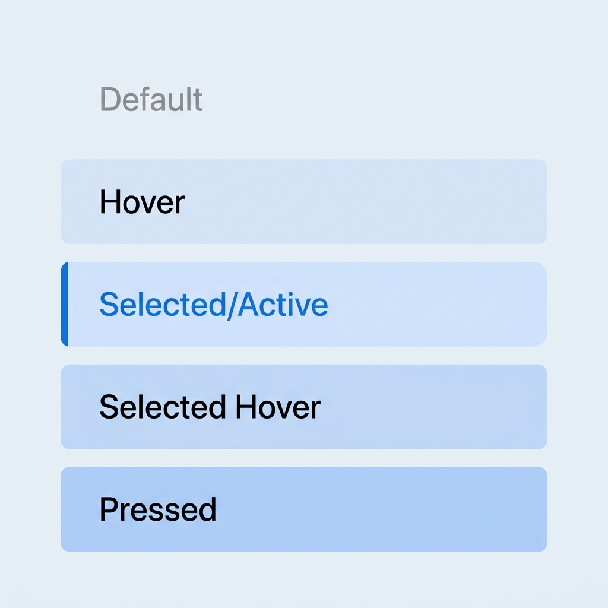

# 縦ナビゲーションリスト (VerticalNavigationList) 設計仕様書

本ドキュメントは、アプリケーションの設定画面等の左側サイドバーで使用される、カテゴリ切り替え用縦ナビゲーションリスト (`VerticalNavigationList`) の詳細仕様を定義するものです。

---

## 1. コンポーネントメタデータ

*   **コンポーネント名**: `VerticalNavigationList`
*   **カテゴリ**: ナビゲーション / グローバルメニュー
*   **コンテキスト**: アプリケーションの機能切り替え用左側サイドバー（例: マスコット、チャットAI、音声AIなど）

---

## 2. 視覚的デザイン例（状態マトリクス）

以下は、縦ナビゲーションリストの各インタラクション状態（Default, Hover, Selected, Selected Hover, Pressed）における視覚的デザイン例です。



---

## 3. レイアウトおよび余白設定（トークン）

```json
{
    "component": {
        "padding": {
            "top": "16px",
            "bottom": "16px",
            "left": "8px",
            "right": "8px"
        }
    },
    "item": {
        "height": "34px",
        "border_radius": "4px",
        "padding_left": "12px",
        "padding_right": "12px",
        "typography": {
            "font_family": "system-ui, -apple-system, sans-serif",
            "font_size": "14px",
            "alignment": "left"
        }
    },
    "animation": {
        "transition": "background-color 0.2s ease, color 0.2s ease"
    }
}
```

---

## 4. インタラクション状態仕様

### 4.1. デフォルト（未選択）
*   **トリガー**: 初期状態 / アイテムがアクティブではない状態。
*   **スタイル**:
    *   背景色: 透明 (`rgba(0, 0, 0, 0.0)`)
    *   文字色: `#333333` (不透明度80%)
    *   フォントウェイト: 通常 (`normal`)
    *   カーソル: デフォルト (`default`)

### 4.2. ホバー（未選択時のホバー）
*   **トリガー**: マウスポインターが未選択のアイテムに入った状態。
*   **スタイル**:
    *   背景色: 極薄いグレーのオーバーレイ (`#FAF5FF`、50% 不透明度)
    *   文字色: 黒 (`#000000`)
    *   カーソル: ポインター (`pointer`)

### 4.3. 選択中（アクティブ）
*   **トリガー**: アイテムがクリックされるか、プログラムによってアクティブ化された状態。
*   **スタイル**:
    *   背景色: 淡いPurple (`#F3E8FF`、100% 不透明度)
    *   文字色: アクセントPurple (`#8B5CF6`)
    *   フォントウェイト: 太字 (`bold`)
    *   左境界線: `4px` のソリッドボーダー (色: `#8B5CF6`)
    *   角丸: 右上・右下のみ `4px`

### 4.4. 選択中ホバー
*   **トリガー**: マウスポインターが現在選択されているアイテムに入った状態。
*   **スタイル**:
    *   背景色: やや濃いPurple (`#E9D5FF`、100% 不透明度)
    *   文字色: アクセントPurple (`#8B5CF6`)
    *   左境界線: `4px` (色: `#8B5CF6`)
    *   角丸: 右上・右下のみ `4px`

### 4.5. マウスダウン（プレス）
*   **トリガー**: アイテム上でマウスの左ボタンが押し下げられた状態。
*   **スタイル**:
    *   背景色: より濃いPurple (`#D8B4FE`、100% 不透明度)
    *   文字色: アクセントPurple (`#8B5CF6`)
    *   左境界線: `4px` (色: `#8B5CF6`)
    *   角丸: 右上・右下のみ `4px`

### 4.6. マウスアップ
*   **トリガー**: マウスの左ボタンが離された状態。
*   **挙動**: 新規選択の場合は「選択中 (4.3)」へ、既に選択済みだった場合は「ホバー (4.2)」へスムーズに遷移します。

### 4.7. タッチ / タップ
*   **トリガー**: タッチスクリーン操作。
*   **挙動**: 即座に「マウスダウン (4.5)」スタイルを適用し、視覚的フィードバックのために `150ms` 維持した後、「選択中 (4.3)」へ遷移します。

### 4.8. キーボードフォーカス (Keyboard Focus)
*   **トリガー**: Tabキーまたは矢印キーによってアイテムにフォーカスが当たった状態。
*   **スタイル**:
    *   アウトライン: `1px` 破線 `#8B5CF6`（または現在の状態の背景スタイルを維持するカスタムフォーカスリング）を現在の背景スタイルの上に表示。

---

## 5. 実装ガードレールおよび制約事項

*   **制約事項 1（テキストオーバーフロー）**: `white-space: nowrap; text-overflow: ellipsis; overflow: hidden;` により、アイテムテキストは決して2行に改行されてはなりません。
*   **制約事項 2（クリックターゲット）**: バウンディングボックス全体（インナーコンテナの幅100%）がインタラクティブである必要があります（`display: flex` または `display: block`）。テキスト部分のみのヒットボックスは無効です。
*   **制約事項 3（アクセシビリティ）**: 標準的なキーボードナビゲーション（フォーカス移動用の上下矢印キー、選択用のEnter/Spaceキー）をサポートする必要があります。
