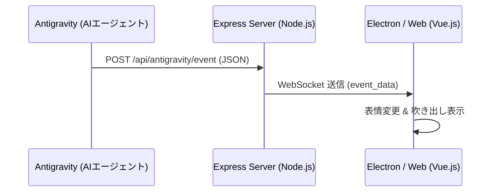
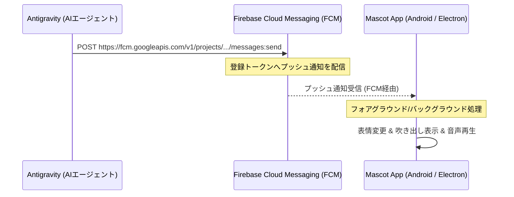

# Antigravity 連携プラグイン仕様書

AIコーディングアシスタント「Antigravity」の各種イベントを受け取り、デスクトップおよびモバイル（Android）マスコットがユーザーにお知らせ（表情変化、セリフ、音声合成）するための連携仕様です。

---

## 1. 概要

Antigravity（本AIエージェントおよび関連CLIツール）が実行するタスクやツールの進捗状況を、「Desktop AI Mascot」にリアルタイムに通知します。
本仕様は、ローカル開発環境での動作に加え、**Android アプリ等のモバイル端末への通知**に対応するため、以下の2つの通信経路をサポートします。

1. **ローカル通信 (HTTP / WebSocket)**: PC上で完結する高速・低遅延な通知経路
2. **クラウドプッシュ通知 (Firebase Cloud Messaging - FCM)**: Android等のモバイル端末や、別ネットワーク上のデバイスへスリープ状態を問わず通知を届ける経路

---

## 2. アーキテクチャ構成

### 2.1. ローカル通信方式（PC内完結）
PC上で Electron と Antigravity が同一環境で動作している場合に最適です。



### 2.2. クラウドプッシュ通知方式（Firebase / FCM 経由）
Android版マスコットアプリへの通知、または別PCで動作するマスコットへの通知に利用します。



---

## 3. 送信データ仕様 (FCM 用ペイロード)

FCM経由で送信する場合、Android / Webクライアント双方がパースしやすいように、FCMの `data` メッセージとして送信します（通知バナーの自動表示を避け、アプリ内で制御しやすくするため）。

### FCM API リクエスト例

- **Method**: `POST`
- **URL**: `https://fcm.googleapis.com/v1/projects/{your-project-id}/messages:send`
- **Headers**:
  - `Authorization: Bearer <ACCESS_TOKEN>`
  - `Content-Type: application/json`

#### リクエストボディ
```json
{
    "message": {
        "token": "DEVICE_FCM_TOKEN",
        "data": {
            "event": "tool_start",
            "message": "MainWindow.xaml.cs を修正しています...",
            "expression": "working",
            "voice_text": "ファイルを修正しています、少々お待ちくださいね。",
            "details": "{\"tool_name\":\"replace_file_content\",\"target_file\":\"MainWindow.xaml.cs\"}"
        }
    }
}
```

---

## 4. イベント種別とマスコットの挙動定義

| イベント (`event`) | 推奨表情 (`expression`) | セリフ・発話例 |
| :--- | :--- | :--- |
| `task_start` | `smile` | 「新しいタスクを開始します！がんばりますね！」 |
| `tool_start` | `working` | 「`{target_file}` の編集を開始しました！」<br>「`{command_line}` を実行しています...」 |
| `tool_end` | `normal` | 「ファイルの編集が完了しました！」 |
| `approval_pending` | `troubled` | 「実行してもいいですか？確認をお願いします！」 |
| `task_complete` | `joy` | 「お疲れ様でした！すべての作業が完了しました！」 |
| `task_fail` | `troubled` | 「エラーが発生してしまいました...ログを確認してください。」 |

---

## 5. マスコット側での実装方針

### 5.1. Android版（Firebase Cloud Messaging）の実装
Android アプリで通知を受信するために、`FirebaseMessagingService` を継承したサービスを実装します。

```kotlin
class MascotFirebaseMessagingService : FirebaseMessagingService() {

    override fun onMessageReceived(remoteMessage: RemoteMessage) {
        super.onMessageReceived(remoteMessage)

        // data ペイロードの解析
        if (remoteMessage.data.isNotEmpty()) {
            val event = remoteMessage.data["event"]
            val message = remoteMessage.data["message"] ?: ""
            val expression = remoteMessage.data["expression"] ?: "normal"
            val voiceText = remoteMessage.data["voice_text"] ?: message

            // アプリケーション内のマスコット状態管理クラスへ伝達
            MascotStateManager.updateState(
                event = event,
                message = message,
                expression = expression,
                voiceText = voiceText
            )
        }
    }

    override fun onNewToken(token: String) {
        super.onNewToken(token)
        // サーバーまたは Antigravity 設定側にデバイストークンを送信して紐付ける
        registerTokenOnServer(token)
    }
}
```

### 5.2. Web/Electron版（Firebase Web SDK）の実装
Web版（PC）でも Firebase JS SDK を使用してプッシュ通知（ブラウザ通知・バックグラウンド受信）を受け取ることができます。

```typescript
import { initializeApp } from "firebase/app";
import { getMessaging, onMessage } from "firebase/messaging";

const firebaseConfig = {
    // プロジェクトの設定値
};

const app = initializeApp(firebaseConfig);
const messaging = getMessaging(app);

// フォアグラウンドでのメッセージ受信
onMessage(messaging, (payload) => {
    if (payload.data) {
        const { event, message, expression, voice_text } = payload.data;
        // マスコットのUIと音声を更新
        updateMascotUI(message, expression, voice_text);
    }
});
```

---

## 6. 設定ファイルへの追加項目 (`system_config.yaml`)

接続方法（ローカル/Firebase）を切り替えるため、以下の設定を追加します。

```yaml
antigravity_plugin:
    mode: "firebase"          # "local" (ローカルExpress経由) または "firebase" (FCM経由)
    local:
        port: 3000
    firebase:
        project_id: "your-mascot-project"
        device_token: "YOUR_DEVICE_FCM_TOKEN" # 通知先デバイスのトークン
        voice_enabled: true
```
