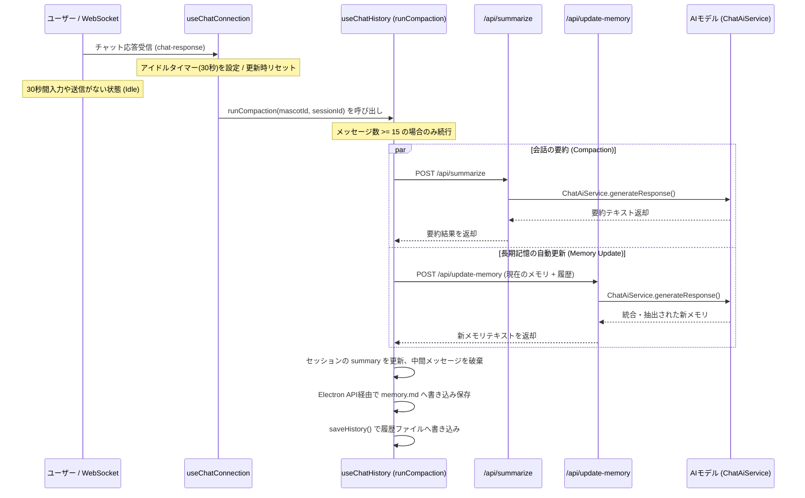

# 会話履歴の圧縮（Memory Compaction）および長期記憶更新 仕様書

本ドキュメントでは、デスクトップAIマスコットにおいて会話履歴が増加した際に実行される「会話内容の要約・圧縮（Memory Compaction）処理」と「長期記憶（`memory.md`）の自動抽出・マージ機能」の仕組みについて説明します。

---

## 1. 概要
会話メッセージ数が増加した際に、LLMのコンテキスト長の上限やトークン制限への到達を防止するため、会話履歴の中間部分を要約して1つの段落に圧縮（Compaction）する機能です。
また、この圧縮のタイミングで会話履歴からユーザーに関する新しい事実や約束事を抽出し、長期記憶（`memory.md`）に自動でマージする機能も連動します。
さらに、これら一連の重い処理がチャットの応答速度を妨げないよう、会話が途切れた「無操作状態（Idle）」を検知してバックグラウンドで非同期実行する制御が導入されています。

---

## 2. 処理フローとトリガー



### トリガーとアイドル制御
- **タイマー制御の導入**:
    - ユーザーとのチャットのやり取りのテンポを最優先するため、応答直後の同期的な実行は行いません。
    - マスコット（AI）からの応答（WebSocket の `chat-response` イベント）を受信完了した時点で、**30秒（30,000ms）のアイドルタイマー**を設定します（[useChatConnection.ts](../../app/src/components/chatpanel/useChatConnection.ts#L103)）。
- **タイマーのリセット（遅延処理）**:
    - タイマー待機中にユーザーがメッセージを送信した（`sendMessage`）場合、タイマーは破棄・クリア（`clearTimeout`）され、実行は延期されます。
    - 会話が完全に途切れ、最後の発話から30秒間無操作状態（入力や送信がない状態）が維持されたときに初めて、バックグラウンドで非同期的に処理が走ります。
- **開始条件**:
    - セッション内のメッセージ履歴の件数が `COMPACTION_THRESHOLD = 15` 以上であること。
    - 要約対象となる「中間の会話（最初のメッセージと最新の6メッセージを除く部分）」が 2 件以上あること。

---

## 3. 会話履歴の圧縮アルゴリズム

[useChatHistory.ts](../../app/src/components/chatpanel/useChatHistory.ts) の `runCompaction` 関数で処理が実行されます。

1. **メッセージの分類**:
    - **初期メッセージ（保存対象）**: `session.messages[0]`（マスコットの開始挨拶など。インデックス0番目のメッセージ）。
    - **最新のメッセージ（保存対象）**: 最新の `PRESERVE_COUNT = 6` 件のメッセージ。これらは文脈の即時応答性を保つために生の対話履歴として残されます。
    - **要約対象メッセージ**: 上記の「初期メッセージ」および「最新の6件」を除いた中間部分（`session.messages.slice(1, -PRESERVE_COUNT)`）。
2. **文字数制限（安全性確保）**:
    - トークン上限や特殊制御文字によるエラーを防ぐため、要約対象の会話履歴全体の総文字数を制限します。
    - 上限文字数は `configStore.summaryMaxCharLimit`（デフォルト: `2500` 文字）。
    - 最新の要約対象メッセージから順に遡り、文字数上限に達するまでメッセージを収集します。上限を超えた古いメッセージは `... (これより前の古い会話履歴は省略) ...` となり、要約から除外されます。
    - 個々のメッセージが300文字を超える場合は、300文字に切り詰めた上で `... (長文のため中略)` を末尾に付加します。
    - 各メッセージは、発話者に応じて「`ユーザー: {本文}`」または「`マスコット: {本文}`」のフォーマットに整形されます。

---

## 4. 要約および長期記憶更新プロンプトの構成

### 4.1 会話要約プロンプト (`/api/summarize`)
1. **共通指示**:
    ```text
    以下の会話履歴を、今後の対話に必要な重要情報を残したまま、簡潔かつ日本語で1つの段落に要約してください。
    ```
2. **以前の要約の継承** (すでに `session.summary` が存在する場合のみ):
    ```text
    以前の要約:
    {session.summary}
    ```
3. **要約対象の会話**:
    ```text
    要約対象の会話:
    {整形済みの会話履歴}
    ```
4. **追加指示**:
    ```text
    要約には、決定事項、重要な話題、マスターとの約束事などを含め、語尾などの不要な会話表現は取り除いてください。
    ```

### 4.2 長期記憶抽出・マージプロンプト (`/api/update-memory`)
会話履歴からユーザーの事実情報や約束事を抽出するためのプロンプトです。

```text
提供された会話履歴から、ユーザー（マスター）に関する新しい事実（名前、趣味、好み、特徴など）や、マスコットとの重要な合意・約束・設定などを抽出してください。
その後、既存の「マスコット長期記憶（Memory.md）」の内容と突き合わせ、情報を更新・追加し、重複や古い情報を整理・マージした最新の Markdown 箇条書きを作成してください。

【既存のマスコット長期記憶（Memory.md）】
{currentMemory || 'なし'}

【今回の会話履歴】
{chatHistory}

【制約事項】
1. # Mascot Long-term Memory という大見出しを最上部に必ず含めてください。
2. 出力は、Markdown の箇条書き部分（# Mascot Long-term Memory で始まる内容）のみを返し、余計な説明文や解説、挨拶、会話文などは一切出力しないでください。
3. 以前の記憶と矛盾する新しい事実がある場合、新しい情報を優先して古い情報を書き換えるか削除してください。
```

---

## 5. 要約・長期記憶更新用AIエンジンの選択

設定画面（`ChatGenSettingsPanel.vue`）から要約エンジンの設定が可能です。

- **設定値 `configStore.summaryEngine`**:
    - **`chat-sync`（デフォルト）**:
        - 現在チャットで使用しているメインエンジン（`selectedEngine` 等）と同期します。
        - チャット側の設定に合わせて、以下のモデルが動的に選定されます。
            - LM Studio: チャットモデル（`lmstudioModel`）
            - Gemini: チャットモデル（`geminiModel`、デフォルトは `gemini-1.5-flash`）
            - OpenAI: チャットモデル（`openaiModel`、デフォルトは `gpt-4o`）
            - Anthropic: チャットモデル（`anthropicModel`、デフォルトは `claude-3-5-sonnet-latest`）
    - **個別エンジン指定 (`gemini`, `lmstudio`, `openai`, `anthropic`)**:
        - 要約処理専用のエンジンおよびモデルを個別に指定します。
            - LM Studio: `summaryLmstudioModel` (または `lmstudioModel`)
            - Gemini: `summaryGeminiModel` (デフォルト: `gemini-1.5-flash`)
            - OpenAI: `summaryOpenaiModel` (デフォルト: `gpt-4o-mini`)
            - Anthropic: `summaryAnthropicModel` (デフォルト: `claude-3-5-haiku-latest`)
- **APIキーの処理**:
    - 選択されたエンジンに応じて、設定済みの API キーが送信されます。

---

## 6. サーバ側の処理

Nuxt (Nitro) イベントハンドラ [summarize.post.ts](../../app/src/server/api/summarize.post.ts) および [update-memory.post.ts](../../app/src/server/api/update-memory.post.ts) にて受け付けられます。

- どちらも `ChatAiService.generateResponse` を呼び出してコンテンツを生成します。
- 呼び出し時の主要パラメータ：
    - `/api/summarize` の `systemPrompt`: `あなたは優秀な対話要約アシスタントです。`
    - `/api/update-memory` の `systemPrompt`: `あなたは優秀な対話分析・記憶管理アシスタントです。`
    - `tools`: すべて `false` に設定（ツール使用は無効化）

---

## 7. 成功時の保存と適用

1. **要約結果のクリーンアップ**:
    - 取得した要約結果テキストから、感情タグ（例: `[joy]`）などの特殊表現を正規表現 `/\[\w+\]/g` で取り除き、前後の不要な空白を `trim()` します。
2. **セッションデータの更新**:
    - `session.summary` に生成された新しい要約テキストを上書き保存します。
    - `session.messages` を `[初期メッセージ, ...保存対象の最新6件のメッセージ]` に置き換え、中間のメッセージ履歴を破棄します。
3. **長期記憶ファイルの自動上書き保存**:
    - 取得した最新の長期記憶データを Electron API `saveMascotPrompts` を通じてディスク上の `app/mascots/<mascot-id>/memory.md` に自動で上書き保存します。
    - Vue側の reactive 状態 `mascotPrompts.memory` にも自動反映され、設定画面に即時反映されます。
4. **UIへの同期**:
    - 現在アクティブなセッションの場合、画面に表示されているメッセージ配列 (`messages.value`) に更新した配列を同期します。
    - 更新されたセッション履歴ファイルをディスクに即時書き出し保存します（`saveHistory()`）。
