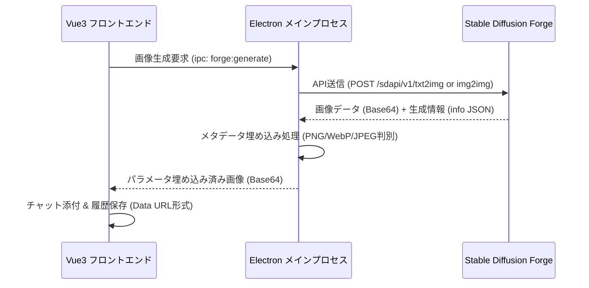

# Stable Diffusion (Forge) 連携仕様書

本ドキュメントは、本デスクトップマスコットアプリにおける Stable Diffusion WebUI Forge との画像生成（t2i, i2i）連携、画像メタデータ（パラメータ）の埋め込み、およびフロントエンド側での復元・UI表示に関する仕様を定義します。

---

## 1. 連携システム概要

本アプリは、ローカルまたはネットワーク上に起動している Stable Diffusion WebUI / Forge の Web API を介して、テキストからの画像生成（txt2img）および画像からの画像編集（img2img）機能を提供します。
さらに、生成された画像そのものに生成プロンプトやモデル、Seed値などのパラメータ情報を自動で埋め込むことで、画像のポータビリティを確保し、チャット内の画像拡大表示時や、画像を i2i の元画像として再利用（i2i移行）する際に、プロンプト等を自動で復元できる設計となっています。

---

## 2. API 通信仕様

メインプロセスの `ForgeConnector` ([forge-connector.ts](../../app/src/connector/forge-connector.ts)) が Forge サーバーとの通信を担当します。

### 2.1 稼働状態確認 (Health Check)
* **エンドポイント**: `GET /` または `GET /sdapi/v1/txt2img`（接続試行）
* **機能**: 接続に成功し、HTTP ステータスが `200` 近辺であれば稼働中と見なす。

### 2.2 リクエスト送信 (txt2img / img2img)
* **エンドポイント**:
  * txt2img: `POST /sdapi/v1/txt2img`
  * img2img: `POST /sdapi/v1/img2img`
* **共通リクエストボディ (JSON)**:
  * `prompt`: 生成プロンプト（最終組み立てプロンプト）
  * `negative_prompt`: ネガティブプロンプト
  * `steps`: 生成ステップ数 (デフォルト: 25)
  * `width` / `height`: 生成解像度
  * `batch_size`: 1 (固定)
  * `cfg_scale`: CFGスケール
  * `sampler_name`: サンプラー名 (例: `Euler a`)
  * `scheduler`: `'Automatic'` (Forge側の sampler/scheduler 自動補正警告を防ぐため固定付与)
  * `override_settings`:
    * `samples_format`: `'png'` (生成形式の PNG オーバーライド要求。ただし、サーバー状態により無視され WebP/JPEG が返ることがある)
    * `sd_model_checkpoint`: モデル切り替え指示がある場合に設定
* **img2img 固有パラメータ**:
  * `init_images`: `[ "Base64Image" ]` (前後の data url プレフィックスを除去した純粋な Base64 文字列)
  * `denoising_strength`: ノイズ除去強度

---

## 3. 生成画像へのパラメータ埋め込み仕様 (メインプロセス)

API から取得された Base64 画像データにはメタデータが含まれていません。そのため、レスポンス内の `info` フィールドから生成パラメータを取得し、画像バイナリに合わせた手法でパラメータテキストを書き込みます。

### 3.1 埋め込み用パラメータテキストの構築
`buildParametersText` が行います。
1. `info` JSON のパースを試み、成功した場合は `info.prompt`（ポジティブ）、`info.negative_prompt`、および各種生成パラメータ（Steps, Sampler, CFG scale, Seed, Size, Model, Model hash, Lora hashes 等）を抽出して WebUI 標準のパラメータテキスト形式に整形します。
2. もし `JSON.parse` が失敗した場合、すでにプレーンテキスト形式であればそのまま返し、生JSON文字列のままであれば正規表現（RegEx）によりプロンプトや Negative prompt、Seed値などを切り出して再構築する堅牢なフォールバックを行います。

### 3.2 フォーマット別の埋め込み手法

#### ① PNG形式 (Signature: `89 50 4E 47`)
* **手法**: `tEXt` チャンクの新規挿入
* **挿入位置**: PNG シグネチャ（8バイト） ＋ IHDR チャンク（25バイト）＝ **先頭から33バイト目**
* **チャンク構造**:
  * Length: 4バイト（ビッグエンディアン、`[Keyword(\0) + Text]` の長さ）
  * Type: 4バイト（`'tEXt'` = `116, 69, 88, 116`）
  * Data:
    * Keyword: `'parameters'`
    * Separator: `0x00` (Null終端)
    * Text: パラメータテキスト (UTF-8)
  * CRC: 4バイト（無符号32ビット整数、Type + Data に対する CRC32 チェックサム。ブラウザに無効なデータとして破棄されないよう厳密に計算）

#### ② WebP形式 (Signature: `52 49 46 46` ... `57 45 42 50`)
* **手法**: カスタムチャンク（`'para'`) のファイル最末尾アペンド
* **注意点**: WebP のチャンク構造上、ヘッダー直後に挿入すると画像情報定義の `VP8X` チャンクが後ろに押し出され画像が破損します。そのため、必ず画像の最末尾に追加し、RIFF ヘッダーのみを更新します。
* **手順**:
  1. 元の RIFF サイズ（先頭4〜7バイト目、リトルエンディアン）を取得。
  2. 新規チャンク（ID: `'para'`, Size: パラメータ長, Data: パラメータテキスト, パディング `0x00`）を作成。
  3. 新しい RIFF サイズ（元のサイズ ＋ 新規チャンク長）を再計算し、4〜7バイト目に書き込み。
  4. 新規チャンクを画像バッファ全体の最末尾に結合。

#### ③ JPEG形式 (Signature: `FF D8`)
* **手法**: Comment セグメント (`FF FE`) の先頭挿入
* **挿入位置**: JPEG シグネチャ `FF D8`（先頭2バイト）の直後
* **構造**:
  * Marker: 2バイト (`FF FE`)
  * Length: 2バイト（ビッグエンディアン、パラメータテキスト長 ＋ 2）
  * Data: パラメータテキスト (UTF-8)

---

## 4. フロントエンド側でのメタデータ抽出・スキャン仕様

画像クリックによる拡大表示時、または画像一覧のホバー時に、画像からパラメータを抽出します ([png-metadata.ts](../../app/src/utils/png-metadata.ts))。

### 4.1 画像デコード
* Data URL (`data:image/...;base64,...`) から Base64 部分を抽出し、空白を除去した上で `atob()` によりデコードし、`Uint8Array` に変換します。

### 4.2 PNG 高速チャンク解析
* ファイルが PNG の場合、先頭からチャンクを走査し、`type` が `'tEXt'` または `'iTXt'` で、かつキーワードが `'parameters'` であるチャンクを探し、そのデータを UTF-8 で復元します。

### 4.3 バイナリ・テキストスキャン (PNG失敗時およびJPEG/WebP)
* パフォーマンス確保のため、画像バイナリの先頭から **256KB** のみを切り出します。
* 切り出したバイナリを `TextDecoder('iso-8859-1')`（Latin-1）でデコードし、1バイトが1文字に対応する検索用テキストを作成します。
* テキスト内から、パラメータブロックの終了シグネチャである `"Steps: "` または `"Negative prompt: "` を検索します。
* 見つかったインデックス（`targetIndex`）から手前2,000バイトの範囲（`chunk`）を切り出し、右から左に向かって Nullバイト（`\x00`）を走査します。
* 検出された `lastNull` インデックスの直後から `targetIndex` までの文字列をパラメータテキスト全体として抽出します。
* 抽出されたテキストに対し、Exifエンコーディング識別子やチャンク名（`UNICODE`, `ASCII`, `para`, `tEXt` 等）を除去し、制御文字を取り除くクリーンアップ（`cleanPromptText`）を実行します。

---

## 5. UI およびインタラクション仕様

### 5.1 i2i 元画像設定とプロンプト自動ロード
* 画像上にホバーした際のクイック設定ボタン（`.use-i2i-btn`）、または画像モーダル下部のアクションボタンを押下すると起動します。
  * **誤判定防止設計**: クイック設定ボタンの親コンテナである `.attachment-image-box` には `position: relative` を適用し、ボタンの絶対配置が枠外に飛び出さないようレイアウト範囲を制限しています。また、非ホバー時（`opacity: 0`）は、ボタン自体に `visibility: hidden;` および `pointer-events: none;` が設定されるため、透明なボタンが入力欄や送信ボタンなどのクリックを誤って遮らない（透過させる）設計となっています。
* 設定されたアタッチメント画像から `extractImagePrompt` を実行してプロンプト部分を抽出。
* チャット入力欄（`inputText`）に抽出したポジティブプロンプトを自動で設定し、画像生成モードを `i2i` に切り替えます。
* チャットテキストエリア（`.message-input`）に自動的にフォーカスを移動させ、ユーザーがすぐに追記できる状態にします。

### 5.2 拡大モーダルアクションバー
画像を拡大した際、画像上に重ねてアクションボタンを配置します。
1. **i2i元画像に設定**: 画像を i2i の元画像に設定しモーダルをクローズ。
2. **生成パラメータ (Informationボタン)**: 画像にメタデータ（生成パラメータ）が含まれている場合のみ表示。押下すると詳細パラメータビューが開きます。
3. **保存先を開く**: アプリ独自の画像を「ダウンロード（保存）」した先である、OS のデフォルト「ダウンロード（Downloads）」フォルダをファイルマネージャーで開きます（メインプロセスとの IPC 通信）。

### 5.3 生成パラメータ詳細ビュー
* モーダル内全体を覆う半透明ダークグレイ（`rgba(15, 23, 42, 0.95)`）の美しいオーバーレイで表示。
* **ワンクリックコピー**: パネル右上のコピーボタンを押すと、すべての生成パラメータテキストをクリップボードにコピーします。コピー成功時にはアイコンがチェックマーク（`pi-check`）にフェード変化するマイクロインタラクションが機能します。

### 5.4 デバッグログ設定オプション
* 設定画面の画像生成設定タブからトグル可能。有効時は、送信した JSON リクエスト payload を Electron ターミナルへ出力します（画像データなどの肥大テキストは自動マスクされます）。
