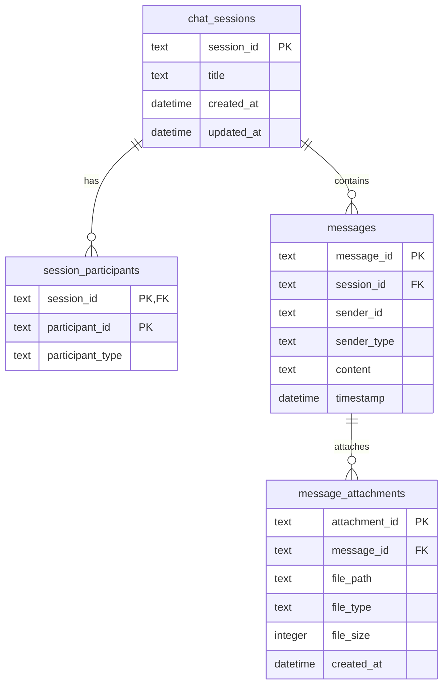

# サーバー側データ管理仕様書 (Data Storage Specification)

マルチクライアント（Web / Electron）およびマルチユーザー（複数マスコット参加のグループ会話など）を想定した、サーバー側のデータ永続化設計仕様書です。

---

## 1. 物理配置・データ構造一覧

データ特性（更新頻度、成長率、ポータビリティ）に合わせて、保存先およびフォーマット（JSON / SQLite）を分離します。

```
app/storage/
├── config.db                                    # アプリケーション全体の共有データ (SQLite)
└── users/
    └── ${user_id}/                              # ユーザー個別ディレクトリ
        ├── user_config.json                     # ユーザーの環境設定（マスコットアセットを除く） (JSON)
        ├── chat_histories.db                    # ユーザーの全対話履歴 (SQLite)
        └── mascots/
            └── ${mascot_id}/                    # マスコット個別ディレクトリ
                └── mascot_config.json           # 表情・衣装・アセット座標等の設定 (JSON)
```

---

## 2. 各データの詳細設計

### 2.1. アプリケーション全体設定: `config.db` (SQLite)
システム全体の共通データ（登録ユーザーリスト、運用ステータス、グローバルログ等）を格納します。
* ※データが極めて軽量な場合は、将来的に `config.json` への変更も検討可能です。

### 2.2. ユーザー設定: `user_config.json` (JSON)
ユーザーの環境設定（テーマ、音量、選択中マスコットID、各種AIサービスのAPIキーなど）を格納します。
* **特徴**: データ量が非常に小さく、クライアント側でオブジェクトとしてそのままロード・保存（アトミック書き込み）を行うのに適しています。
* **保存項目例**:
  ```json
  {
      "theme": "dark",
      "volume": 80,
      "activeMascotId": "mascot_1",
      "googleAiStudioApiKey": "AIzaSy...",
      "chatOpacity": 1.0,
      "chatAlwaysOnTop": "sync"
  }
  ```

### 2.3. マスコット設定: `mascot_config.json` (JSON)
マスコットごとのアセット定義（表情や衣装の画像パス、オフセット座標、スケール）や、そのマスコット独自のAIプロンプト、音声設定などを格納します。
* **物理パス**: `app/storage/users/${user_id}/mascots/${mascot_id}/mascot_config.json`
* **特徴**: 表情の作成や衣装変更時に、このファイルのみを対象にアトミックな保存（一時ファイルを経由した置換）が行われるため、他の設定ファイルを巻き込んで破損させるリスクがありません。

### 2.4. 会話履歴データ: `chat_histories.db` (SQLite)
ユーザーが所持するすべてのマスコットとの対話履歴を一元管理します。
将来的な「ユーザー1：マスコット複数」のグループ会話セッションに対応可能なテーブル設計とします。
* **物理パス**: `app/storage/users/${user_id}/chat_histories.db`
* **特徴**: 対話量に比例して無限に大きくなり得るため、RDB（SQLite）でインデックスを効かせて検索・追記します。ユーザーフォルダ内に配置されるため、ユーザー削除時はフォルダごと消去するだけでクリーンアップが可能です。

---

## 3. 会話履歴データベース (chat_histories.db) 設計

### 3.1. テーブル構造 (ER Diagram)



### 3.2. スキーマ定義

#### `chat_sessions` テーブル (会話セッション/ルーム)
対話を行う部屋（個別チャット、あるいは複数マスコットが参加するグループチャット）を管理します。

| カラム名 | データ型 | 制約 | 説明 |
| :--- | :--- | :--- | :--- |
| `session_id` | TEXT | PRIMARY KEY | セッションの一意なID |
| `title` | TEXT | | セッションのタイトル (例: 'AIキャラクター座談会' など) |
| `created_at` | DATETIME | DEFAULT CURRENT_TIMESTAMP | 作成日時 |
| `updated_at` | DATETIME | DEFAULT CURRENT_TIMESTAMP | 更新日時 |

#### `session_participants` テーブル (セッション参加者マッピング)
特定の会話セッションに参加しているメンバー（ユーザーおよびマスコット）を管理します。
* **グループ対話への対応**: 1つの `session_id` に対し、複数のマスコットID（`participant_type = 'mascot'`）およびユーザーID（`participant_type = 'user'`) を登録することで、N:M の関係を構築可能です。

| カラム名 | データ型 | 制約 | 説明 |
| :--- | :--- | :--- | :--- |
| `session_id` | TEXT | PK / FK | 対象のセッションID |
| `participant_id` | TEXT | PK | 参加者のID (ユーザーID、またはマスコットID) |
| `participant_type`| TEXT | NOT NULL | 参加者の種別 (`'user'` または `'mascot'`) |

#### `messages` テーブル (対話発言レコード)
セッション内で飛び交う各発言（会話履歴）を記録します。

| カラム名 | データ型 | 制約 | 説明 |
| :--- | :--- | :--- | :--- |
| `message_id` | TEXT | PRIMARY KEY | メッセージ一意のID |
| `session_id` | TEXT | NOT NULL / FK | 所属するセッションID |
| `sender_id` | TEXT | NOT NULL | 送信者のID (ユーザーID、またはマスコットID) |
| `sender_type` | TEXT | NOT NULL | 送信者の種別 (`'user'` または `'mascot'`) |
| `content` | TEXT | NOT NULL | 発言内容テキスト |
| `timestamp` | DATETIME | DEFAULT CURRENT_TIMESTAMP | 送信日時 |

#### `message_attachments` テーブル (メッセージ添付ファイル)
対話メッセージに添付される画像、音声、その他メディアファイルを一対多 (1:N) で管理します。

| カラム名 | データ型 | 制約 | 説明 |
| :--- | :--- | :--- | :--- |
| `attachment_id` | TEXT | PRIMARY KEY | 添付ファイルの一意なID |
| `message_id` | TEXT | NOT NULL / FK | 紐づくメッセージID |
| `file_path` | TEXT | NOT NULL | ファイルの保存先相対パスまたは相対URL |
| `file_type` | TEXT | NOT NULL | ファイルのMIMEタイプ (例: `'image/png'`, `'audio/wav'`) |
| `file_size` | INTEGER | | ファイルサイズ (バイト数) |
| `created_at` | DATETIME | DEFAULT CURRENT_TIMESTAMP | アップロード/生成日時 |

---

## 4. トリガー定義
`chat_sessions` テーブルの最終更新日時を自動で更新します。

```sql
CREATE TRIGGER IF NOT EXISTS update_chat_sessions_time
AFTER UPDATE ON chat_sessions
BEGIN
    UPDATE chat_sessions SET updated_at = CURRENT_TIMESTAMP WHERE session_id = NEW.session_id;
END;
```
