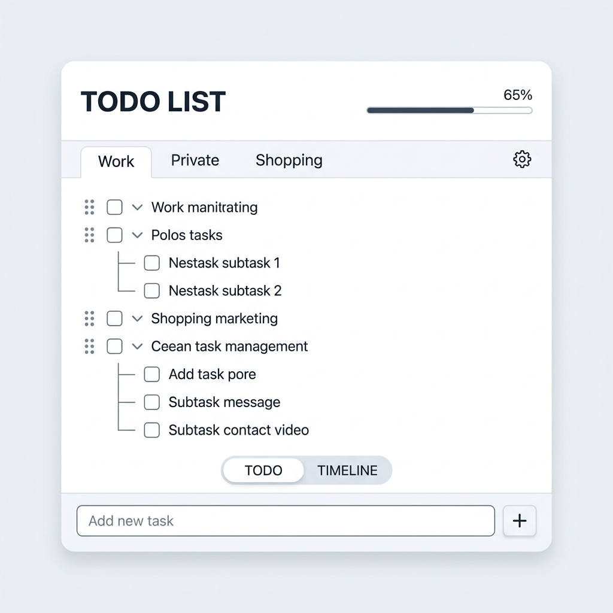

# タスク管理ウィジェット（Quest Log）仕様書

## 1. 概要
本ウィジェットは、チャットと同時に表示して操作できる、独立したフローティング型のタスク管理ツールです。
アプリのウィンドウモード（統合ウィンドウ / 分離ウィンドウ）に応じて、適切な移動・ドラッグ動作を行います。

---

## 2. 機能・配置要件

### 2.1. ウィンドウモードに応じた移動制御
- **分離ウィンドウモード（split / compact モード時）**:
  - デスクトップ上に独立した透過 Electron ウィンドウ（ハッシュ: `#tasks`）として起動します。
  - ウィンドウ全体がデスクトップ上のどこへでも自由にドラッグ移動可能です。
- **統合ウィンドウモード（integrated / web モード時）**:
  - `IntegratedLayout` 内のフローティングUI（最前面レイヤー）として描画されます。
  - 統合ウィンドウのエリア内限定で自由にドラッグ移動（位置カスタマイズ）が可能です。

### 2.2. 移動ハンドラ（ドラッグエリア）
- ウィジェットの最上部ヘッダー部分（「TODO LIST」や進捗ゲージがある領域）をマウスでドラッグすることで移動できます。
- **Electron独立窓**: 移動時に `electronAPI.dragWindow` を呼び出してデスクトップ上のウィンドウ位置を動かします。
- **統合ウィンドウ内**: ドラッグ時にウィジェット自身の `absolute` 座標（`top`, `left`）を動的に更新します。

### 2.3. タスク表示の開閉制御
- チャットパネルのヘッダーにある「タスクボタン（チェックボックスアイコン）」は、タスク管理ウィジェットの表示・非表示（開閉）を切り替えるトグルスイッチとして機能します。
- **分離モード**: トグルによって独立タスクウィンドウの表示（show）/非表示（hide）を Electron 経由で制御します。
- **統合モード**: トグルによって `IntegratedLayout` 内のウィジェットの描画フラグを切り替えます。

### 2.4. 位置の保存・復元
- 統合ウィンドウモード内でのドラッグ移動完了時（`mouseup`）、ウィジェットの座標 (`posX`, `posY`) は `localStorage` (`task_widget_pos_x`, `task_widget_pos_y`) に保存されます。
- ウィジェットのマウント時に保存された位置が自動で復元され、次回起動時やリロード時にも前回の表示位置が維持されます。

### 2.5. カテゴリ分類と表示フィルター
- **ALL カテゴリ**:
  - 特定のカテゴリに限定せず、登録されているすべてのタスクを横断して一括表示する「ALL」タブを提供します。
- **完了一覧（COMP）表示**:
  - 通常のタスク一覧とは別に、完了済みタスクのみをアーカイブとして振り返るための「COMP」タブを提供します。

### 2.6. タスク完了（DOING -> DONE）の遷移遅延
- 誤操作防止および完了演出のバッファとして、タスクのチェックボックスをON（完了）にした際、**約5秒間の待機時間（カウントダウン）**を挟んでから実際の完了状態（DONE）へと遷移します。この待機時間中は、チェックをOFFにすることで完了処理をキャンセル可能です。

### 2.7. 誤削除防止（削除モード）
- 通常表示時の誤操作によるタスク消失を防ぐため、タスク一覧上に常時削除ボタンは表示されません。
- 削除を行う場合は、ヘッダー等の専用スイッチから**「削除モード」をON**にする必要があり、このモード中のみ各タスクに削除（ゴミ箱）アイコンが表示されます。

### 2.8. 予定日時の設定と時間入力UI
- タスクの予定日時設定（カレンダーアイコン 📅 クリック時）は、ウィジェットの全面を覆う「全面カレンダー設定パネル」が立ち上がります。
- **日付選択**: PrimeVue の `DatePicker` を使用します。
- **時間帯選択（1日タイムラインピッカー）**:
  - 0:00〜24:00の縦型タイムラインを表示し、Google Calendarと同様にドラッグ操作で予定の開始・終了時刻を同時に指定します。
  - 選択範囲は15分単位でスナップし、タイムライン上の予定ブロックと上部の開始・終了時刻入力欄へ反映します。
  - タイムラインをクリックした場合は、TODO Widget設定のデフォルト所要時間を使って終了時刻を補完します。
  - 既存の円形クロックピッカーは `CircularClockPicker` として独立コンポーネント化し、開始日時・終了日時を個別編集する画面で使用します。
- **予定日時の先行設定**: 新規タスク追加フォームにて、タスク名を入力する前にあらかじめ期限日時を設定しておくことが可能です。
- 予定開始は `scheduledAt`、予定終了は `scheduledEndAt` に保存します。実際の作業開始・完了を表す `startedAt` / `endedAt` とは分離します。
- `会議` カテゴリの予定日時設定では、最初に「今日」「明日」「日付指定」の3項目を表示します。「今日」「明日」は選択後すぐ時刻設定へ進み、「日付指定」を選んだ場合だけカレンダーへ切り替えます。
- `会議` カテゴリを含む予定の時間帯は、タイムラインで選択した開始を `scheduledAt`、終了を `scheduledEndAt` に保存します。既存の終了日時がない場合の初期選択にはTODO Widget設定のデフォルト所要時間を使用します。

### 2.9. 期限超過タスクの警告
- 予定日時（期限）が現在時刻を超過した未完了タスクは、一目で判別できるように文字色の変更（赤色）や警告デザインによって視覚的に強調されます。

### 2.10. タスク詳細編集
- タスクの個別項目（タイトル、期限、優先度、カテゴリなど）をダイレクトに変更するための「タスク編集画面」を提供します。
- 開始日時は、通常の予定日時設定と同じ全面カレンダーおよび24時間ドラッグクロックピッカーで設定します。
- 終了は「所要時間」または「終了日時」のいずれかを選んで設定します。両方を同時に指定することはできません。
- 所要時間の既定値はTODO Widget設定画面で変更でき、初期値は1時間です。既存データに有効な開始・終了日時がある場合は、その差を所要時間の初期値として表示します。
- 所要時間を選んだ場合は開始日時に所要時間を加算した日時を `scheduledEndAt` として保持します。終了日時を選んだ場合は、通常の予定日時設定と同じ日時ピッカーで指定した値を `scheduledEndAt` として保持します。
- TODO／TIMELINE／COMPの各ビューに、TODO Widget設定画面を開く歯車ボタンと削除モードを切り替える削除ボタンを表示します。各タスクの削除操作は削除モード中のみ表示します。

### 2.11. 標準カテゴリ
- 初期カテゴリとして `Work`、`Private`、`会議` を提供します。
- `会議` は固定ID `meeting` を持ち、会議中の通知制御で安定して判定できるよう、名前変更および削除はできません。
- 既存ユーザーのカテゴリに `meeting` が存在しない場合は、自動的に追加して保存します。

### 2.12. 会議中の音声ミュート
- TODO Widget設定の「会議中は音声をミュートする」が有効な場合、現在時刻が未完了の会議タスクの `scheduledAt` 以上かつ `scheduledEndAt` 未満なら、タスクのお知らせをTTS再生しません。
- 会議中もOS通知とマスコットの吹き出しは表示し、対象タスクの `notified` は通常どおり更新します。
- 通知は `triggerTimerNotification` に一本化し、TTSと吹き出しは現在のウィンドウモードでマスコットを所有する1画面だけが処理します。
- 同じ予定に対する複数レンダラーからの発火は、タスクIDと予定開始日時から作る通知IDで重複排除します。
- チャット上部の音声ON/OFFボタンはアプリ全体の音声ミュートとして扱い、OFFの場合はチャット応答、予定通知、一時タイマーをすべて読み上げません。再生中にOFFへ切り替えた場合は現在の音声も停止します。
- TODO Widgetの「予定を通知する」は予定通知そのもの（OS通知・吹き出しを含む）の有効／無効であり、音声だけの切り替えには使用しません。
- 将来追加する環境音は本設定の対象に含めず、独立した再生設定として扱います。

### 2.13. サブタスクの詳細管理
- サブタスクごとに開始日時、終了日時、内容（詳細・メモ）を設定し、保存後に再編集できます。
- サブタスクを折り畳み・展開でき、折り畳み状態は親タスクの `expanded` に保持します。
- 進行中のサブタスクは個別に中断でき、中断中のサブタスクは個別に再開できます。
- サブタスク内の順序はドラッグ＆ドロップで変更でき、変更後の配列順を永続化します。
- 各サブタスクに日時設定ボタンを表示し、日時編集画面を直接開けます。

---

## 3. UI・デザイン要件
- **配色と形状**:
  - 背景：ソフトライトグレー/ブルー（`#f1f5f9`）
  - カード：純白（`#ffffff`）、角丸（`12px`）、ソフトな影（`shadow-sm`）
  - ハイライト：標準的なモダンブルー（`#3b82f6`）
- **レイアウト順序**:
  1. **ヘッダー (ドラッグ移動領域)**: 「TODO LIST」タイトル、全体進捗の水平ゲージ（プログレスバー）、および削除モード切り替えスイッチ。
  2. **カテゴリ・タブ列**: 「ALL」タブ、ユーザー定義のカスタムカテゴリタブ、および「COMP」（完了）タブ。タブ管理ボタン。
  3. **メインスクロールエリア**: ドラッグハンドル付きタスクツリー（TODO）、または時系列タイムライン（TIMELINE）。
  4. **ビュー切り替えタブ**: 「TODO」と「TIMELINE」のトグルボタン。
  5. **最下部固定フォーム**: 予定日時の先行設定用カレンダーボタン付きのタスク新規追加フォーム。
