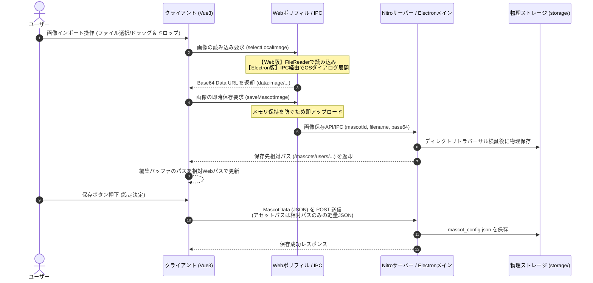

# マスコット画像取扱仕様書 (MascotImageHandling.spec)

このドキュメントは、デスクトップAIマスコットアプリにおけるマスコット画像アセット（カバー画像、服装、表情、ポーズ）のクライアントサイドにおける保持方法、インポート処理、サーバーサイドへの永続化、および描画・サーブ時の動作仕様について定義したものです。特に、Web版（ブラウザ版）動作時における認証・認可、およびElectron版との差異について詳細に解説します。

---

## 1. 概要

本アプリケーションは、将来的なブラウザ（Web UI）動作への移行を見据え、フロントエンド共通層とプラットフォーム（シェル）層が疎結合になるよう設計されています。画像選択後の保存処理は共通のレンダラーAPIから呼び出しますが、Web版はNitro API、Electron版はメインプロセスのIPCハンドラーを使用します。どちらの経路も同じ相対アセットパス形式と保存先構造を採用します。

---

## 2. 画像アセットのインポートから永続化の流れ (データフロー)

ユーザーが新規画像をインポートし、マスコットのアセットとして保存するまでのデータフローは以下の通りです。本システムでは、画像のインポート直後に個別に画像データを即時保存する「即時アップロード方式」を採用しています。



### 2.1. クライアントサイドでのインポートと即時アップロード
ユーザーがマスコット編集画面（`MascotSettings.vue` / `SpriteImportModal.vue` など）で画像ファイルを選択するか、ドラッグ＆ドロップした際、クライアントは画像をメモリ内に長く保持せず、即座にサーバー（またはElectronメインプロセス）へアップロードします。

- **Web版の動作 (`browser-polyfill.ts` / Vue内実装)**:
    - ブラウザの `<input type="file">` 要素からファイルを受け取り、`FileReader.readAsDataURL()` で一時的に Base64 Data URL を作成。
    - 直後に `uploadImportedImage` ヘルパーを呼び出し、Web API `/api/mascots/save-image` を通して画像を即時アップロード。
    - アップロードが成功した場合は、編集バッファ（`editingMascot`）の画像パスを即座に相対Webパス（`/mascots/users/...`）に書き換え、プレビューにはこの相対パスを使用します。
- **Electron版の動作**:
    - IPC メソッド `select-local-image` を介してメインプロセスを呼び出し、選択された画像を Base64 Data URL 形式でフロントエンド側へ返却。
    - フロントエンドは即座に IPC メソッド `save-mascot-image` を呼び出してファイルを保存し、返却された相対パスをアセットに格納します。

### 2.2. クロップ（トリミング）プレビューの一時オブジェクト（Blob/ObjectURL）化
表情クロップ機能など、一時的なプレビューのためにメモリ上に大きな画像データを保持する必要がある場合、V8ヒープの肥大化を防ぐために以下の最適化を適用します。
- クロップ元の選択画像が Base64 形式の場合、即座にバイナリ Blob へ変換し、`URL.createObjectURL(blob)` を用いた一時オブジェクトURLで描画エンジンに渡します。
- 元画像はBase64文字列ではなくBlobとして保持し、クロップ確定時のアップロードに必要な短時間だけData URLへ変換します。
- クロップモーダルが閉じられた際、またはクロップ完了時には、必ず `URL.revokeObjectURL(url)` を呼び出してメモリを明示的に解放します。

### 2.3. 設定保存APIの呼び出し（軽量全体POST）
ユーザーが設定を保存する際、クライアントはマスコット設定オブジェクト（`MascotData`）をJSON形式でサーバー（`/api/mascots` または `/api/mascots/[id]`）に POST 送信します。
この時、画像データはすでにアップロードを終えて相対アセットパスに置き換わっているため、送信されるJSONペイロードは非常に軽量です。

- **後方互換用フォールバック**:
    - ネットワーク不通時やAPIエラー発生時に備え、クライアントはアップロードに失敗した場合でも一時的にBase64をアセットパスに保持して設定を保存するフォールバック処理を備えています。
    - サーバー側（`index.post.ts` / `[id].post.ts`）は、受け取ったJSON内に依然として `data:image/` のBase64データが含まれる場合は、自動的にデコードして物理ファイルに保存する互換処理（`processMascotAssets`）を実行します。

---

## 3. 画像表示（描画）時のパス解決

マスコット描画エンジン（`MascotViewer.vue` / PixiJS）がマスコット画像を描画する際、設定JSONに記述されたパスを実際の読み込み用URLに解決します。

### 3.1. クライアントサイドでのURL解決 (`resolveImageUrl`)

`MascotViewer.vue` の `resolveImageUrl` 関数は、画像パスのスキームに応じて以下のようにURLを解決します。

```typescript
const resolveImageUrl = (path: string | undefined | null): string => {
    if (!path) return '';
    if (path.startsWith('data:image/') || path.startsWith('blob:')) {
        return path; // 一時プレビュー用（Base64 または ObjectURL）
    }
    let resolved = path;
    if (path.startsWith('/mascots/')) {
        // relativeパスをサーバーのアドレス (Host & Port) を含む絶対URLに解決
        resolved = `http://${configStore.serverHost}:${configStore.serverPort}${path}`;
    }
    if (/^[a-zA-Z]:\\/.test(resolved)) {
        return resolved; // Windowsローカルの絶対パス（下位互換・デバッグ用）
    }
    const separator = resolved.includes('?') ? '&' : '?';
    return `${resolved}${separator}v=${configStore.configVersion}`; // キャッシュバスターの付与
};
```

解決されたURLは PixiJS の `Assets.load(url)` に渡され、HTTP経由で非同期にロードされます。

---

## 4. Webサーバーによる画像配信とセキュリティ認可

クライアントから `/mascots/` で始まる画像URLへのHTTPリクエストが送信されると、Webサーバー（Nuxt/Nitro）のルートハンドラーがこれを捕捉し、セキュリティ検証を行った上で配信します。

### 4.1. 静的ルートハンドラー (`app/src/server/routes/mascots/[...path].ts`)

リクエストURLからサブパスを抽出し、`resolveMascotPath` を使用して物理ディスク上の絶対パス（`targetPath`）に逆変換します。

### 4.2. セキュリティ認可（画像サーブおよび保存時の重要制御）

アセットに対する不正な読み書きやディレクトリトラバーサルを防ぐため、物理パスへのアクセスに厳格な検証を実施します。

1. **ディレクトリトラバーサル防止（画像保存時）**:
    - リクエストに含まれる `mascotId` や `filename` に対し、親ディレクトリへの遡行（`..` や `\`）が含まれていないかを検証します。
    - `resolveMascotPath` によって解決された絶対パスが、本来許可されているマスコット基準ディレクトリ（`storage/users/{userId}/mascots/{mascotId}`）の配下に完全に含まれていることを `path.relative` の差分により検証し、想定外の領域へのファイルの保存や読み出しを防止します。
2. **ログインユーザー情報の取得**:
    - **開発環境のローカルアクセスバイパス**: リクエストの送信元IPがループバックアドレス（`127.0.0.1`, `::1`）の場合、ローカルデバッグ実行とみなし、ユーザーIDを `usr_local_dev_bypass` として認証をバイパスします。
    - **リモートアクセス**: `Authorization` ヘッダーまたはクッキーからトークンを抽出し、`authenticateUserToken(token)` を呼び出してユーザーID（`loginUserId`）を取得します。
3. **所有者（オーナー）の一致検証**:
    - 物理パスからアセットの所有者ID（`ownerUserId`）を抽出し、特定された `loginUserId` と一致するかを検証します。不一致の場合は `403 Forbidden` を返します。

---

## 5. Electron版とWeb版の動作的な相違点まとめ

| 項目 | Electron版 | Web版（ブラウザ版） |
| :--- | :--- | :--- |
| **動作アーキテクチャ** | フロントエンドからローカルループバックで内部Nitroサーバーに接続。 | 外部にホストされた統合Nuxtサーバー、またはローカル開発サーバーに接続。 |
| **ローカル画像選択** | `select-local-image` IPCを介してOSネイティブのダイアログを使用。 | ブラウザ標準の `<input type="file">` 要素と `FileReader` API を使用。 |
| **メモリ上での保持形式** | `相対パス`（インポート時に即アップロード保存されるため）。 | `相対パス`（インポート時に即アップロード保存されるため）。 |
| **アセット保存処理** | レンダラーから `saveMascotImage` IPCを呼び出し、メインプロセスがローカルストレージへ直接物理保存。 | `/api/mascots/save-image` にPOSTし、接続先Webサーバーがサーバー側ストレージへ物理保存。 |
| **セキュリティ認可（サーブ時）** | 常にローカルアクセスバイパス（`usr_local_dev_bypass`）が適用され、認証が自動パスされる。 | リモート接続時は `Bearer` トークンやセッションクッキーの検証により、リソース所有者の一致を厳密に検証。 |
| **設定ファイルの永続化** | アプリの環境設定等は `config.json` にローカル保存されるが、マスコットデータは肥大化防止のため除外され、Web版と同様にサーバー側の `mascot_config.json` に保存。 | 環境設定・マスコットデータ共にサーバー側データベースまたはローカルストレージ/ファイルで管理。 |

---

## 6. 対応済みの改善（2026-07 実装完了）

### 6.1. 保存経路の不整合の解消（即時アップロード化）
衣装（立ち絵）および表情の追加・切り抜き処理では、正常系において個別のアセット保存API/IPCを実行し、編集バッファを相対パスへ置き換えます。これにより通常の設定保存時にBase64が全体POSTへ含まれることを抑制します。アップロード失敗時や背景除去結果など、互換処理が必要な経路ではBase64を一時保持し、設定保存API側のフォールバック処理で物理ファイルへ変換します。

### 6.2. プレビュー画像のメモリ最適化
切り抜き用などのプレビュー画像データは、V8ヒープの肥大化を防ぐためにBlobとして保持し、ObjectURLによる参照渡しに移行しました。クロップ確定時のみアップロード用Data URLを生成し、使用後は速やかに`revokeObjectURL`を呼び出します。

### 6.3. セキュリティ防御の強化
外部から指定される `mascotId` や `filename` に対するバリデーション、および `path.relative` を用いたマスコット配下ディレクトリ以外の書き込み制限（ディレクトリトラバーサル対策）を Electron メインプロセスおよび Web API 双方に実装しました。

---

## 7. 今後の残課題（推奨ロードマップ）

### 7.1. キャッシュのアセット単位化（推奨B - サーバー主導案C）
* 画像変更時にブラウザの古いキャッシュ（`max-age=3600`）により即座に画像が反映されない課題が残っています。
* サーバー配信側（`[...path].ts`）で `ETag` や `Last-Modified` を設定した上で `Cache-Control` を `no-cache` に変更し、条件付きGET（304）を機能させることでキャッシュ効率の向上と即時反映を両立します。

### 7.2. PixiJS のテクスチャリーク防止
* レンダラー側で画像パスが切り替わった際、古い画像URLのテクスチャを明示的に解放（`Assets.unload`）しないとテクスチャキャッシュがメモリを圧迫し続けるリスクがあるため、PixiJS描画コンポーネント内でのクリーンアップ処理を導入します。
