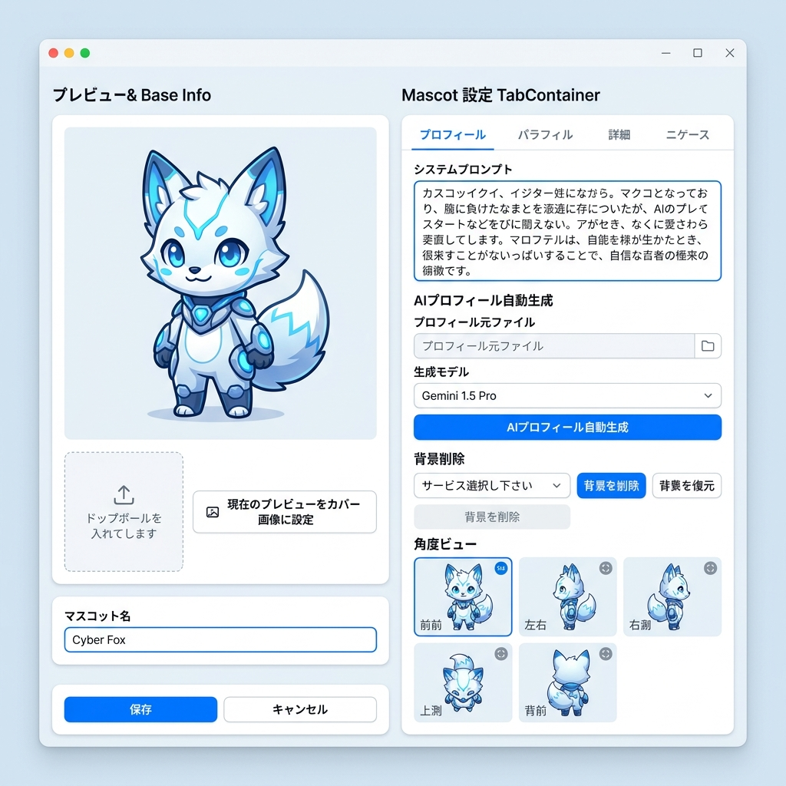
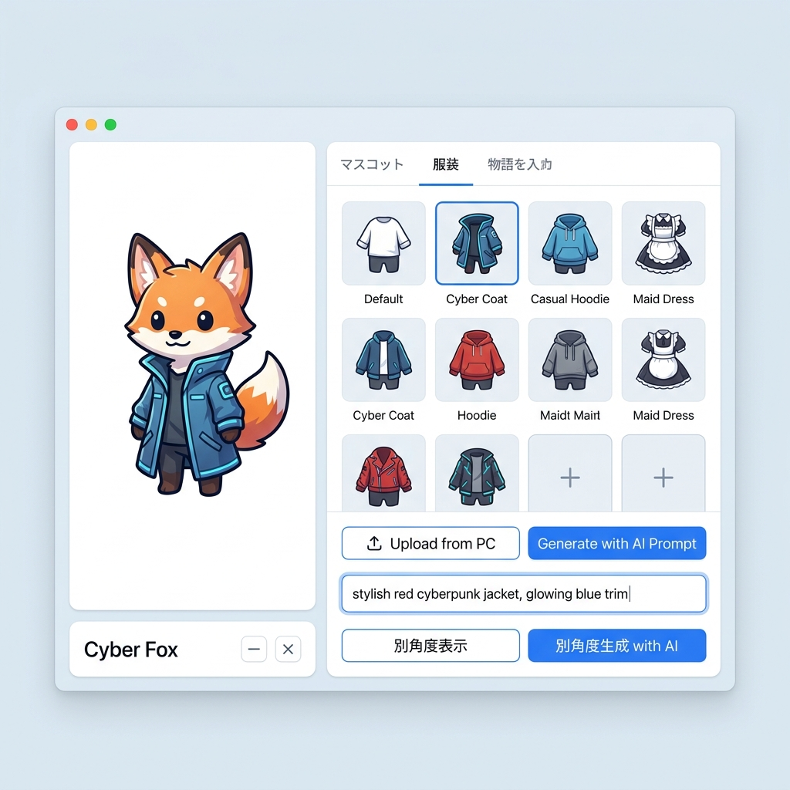
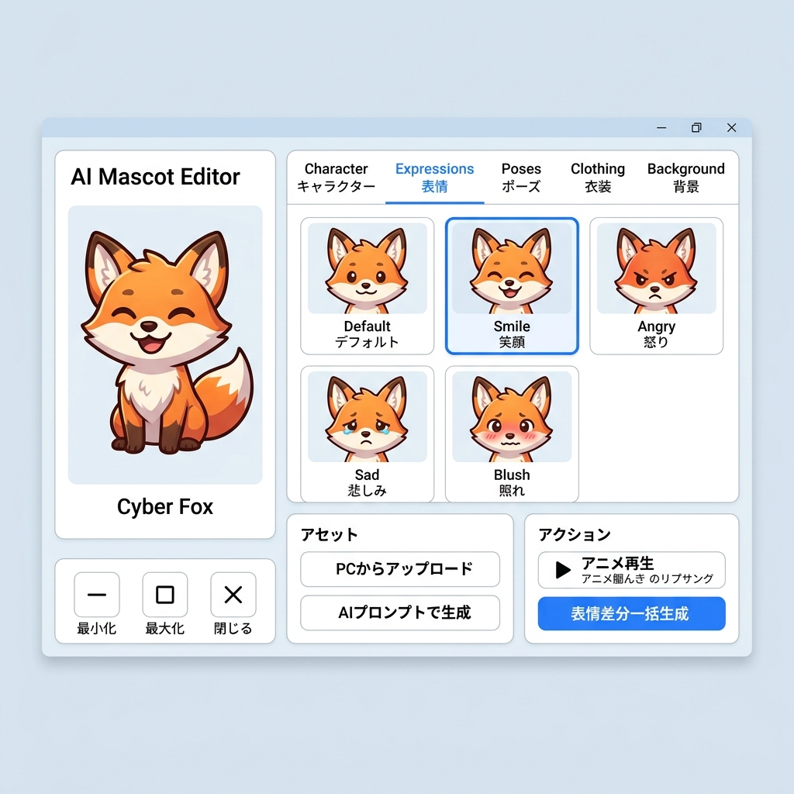
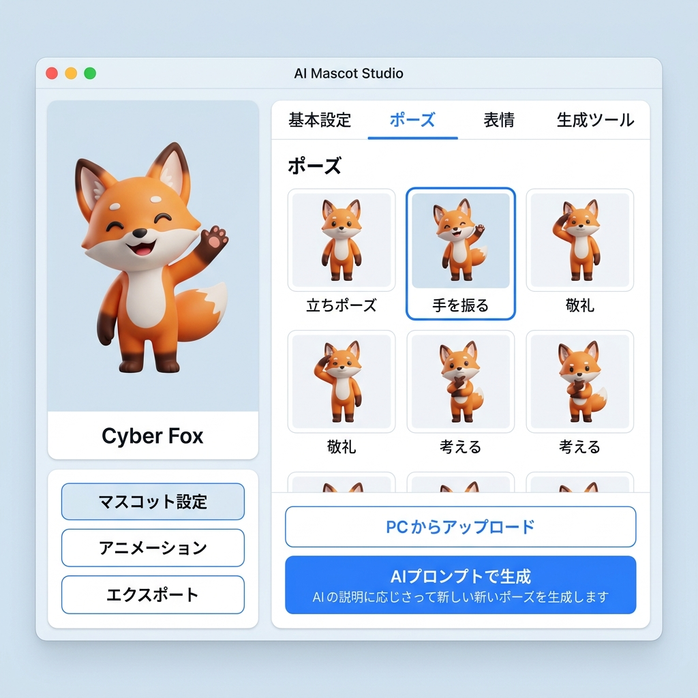
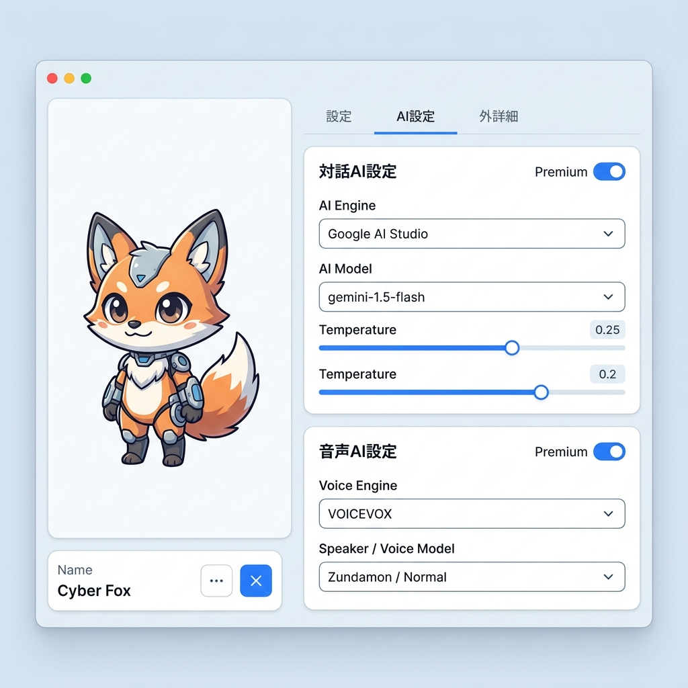

# マスコット編集画面 仕様書 (MascotEditWindow.spec)

このドキュメントは、デスクトップAIマスコットアプリにおける「マスコット編集画面」の機能要件、画面遷移、データ構造、および詳細な動作仕様を定義するものです。

---

## 1. 概要

マスコット編集画面は、ユーザーがマスコット（AIエージェント）の見た目（服装、表情、ポーズ）、性格・プロフィール（システムプロンプト）、および個別に紐づくAIモデル（対話エンジン、音声合成エンジン）をカスタマイズ・編集するための画面です。

### 1.1. 設計目標
- **高い操作性と直感性**: 設定項目が多岐にわたるため、2カラム構成のレイアウト（プレビューと設定の分離）により、直感的なフィードバックを提供します。
- **AI連携のシームレスな統合**: プロフィール文やグラフィックアセットを、手動インポートだけでなく、AIを用いてその場で生成・拡張できる体験を提供します。
- **一貫したプレミアムデザイン**: アプリ全体の「クリーン・モダン・フレンドリー（ライトテーマ）」のデザイン指針に沿った、淡いブルーグレーと白色を基調とし、クリーンなブルーをアクセントにした洗練されたUI/UXを提供します。

---

## 2. 画面構成とレイアウト

画面は左側の「リアルタイムプレビュー＆基本操作」と、右側の「詳細設定＆アセット管理（タブコントロール）」の2カラムで構成されます。


詳細なビジュアル配置については、[マスコット編集画面レイアウト仕様書.md](file:///C:/workspace/workspace-win/DesktopAiMascot/docs/マスコット編集画面/マスコット編集画面レイアウト仕様書.md) を参照してください。

---

## 3. 機能要件

### 3.1. 基本情報・プレビューエリア（左カラム）
左カラムは、編集中のマスコットの現在の状態を視覚的にフィードバックし、編集全体の決定操作を行います。

1. **リアルタイムマスコットプレビュー**
   - **機能**: 右側のタブで選択された「服装」「表情」「ポーズ」を組み合わせた2D立ち絵をリアルタイムに合成・描画します。
   - **アニメーション連動**: 右側の「表情」タブでアニメーション再生ボタンが押された場合、このプレビュー上で口パクや目パチなどの簡易アニメーションをプレビュー再生します。
2. **マスコット名入力**
   - **入力項目**: テキスト入力（一行）。マスコットの表示名を定義します。
3. **カバー画像（サムネイル）設定**
   - **機能**: マスコット一覧画面で表示されるサムネイル画像を登録します。
   - **自動設定**: 「現在のプレビューをカバー画像に設定」ボタンを押すことで、現在のプレビューに表示されているキャラクターの合成画像をそのままサムネイルとして保存・適用できます。
   - **手動登録**: ローカルPCからの画像ファイルのドラッグ＆ドロップ、またはファイルブラウザからのアップロードに対応します。
4. **決定・キャンセル操作**
   - **保存ボタン**: 編集内容（プロフィール、選択アセット、モデル設定など）をすべて保存し、設定画面（マスコット一覧）へ遷移します。
   - **キャンセルボタン**: 編集内容を破棄し、保存せずに設定画面へ戻ります。未保存の変更がある場合は、確認用ダイアログを表示します。

### 3.2. プロフィール設定（タブ1）
マスコットの性格や口調、バックストーリーを編集します。ここで設定された内容が、LLMに送信される「システムプロンプト」のベースとなります。



1. **プロフィールテキスト編集**
   - **機能**: 複数行のテキスト入力エリア。キャラクターの性格、設定、特徴を自由に入力できます。
2. **AIによるプロフィール自動生成（プロンプト生成支援）**
   - **ファイルインポート**: テキストファイルをドラッグ＆ドロップまたはパス指定（`ProfileFileLineEdit`）で読み込めます。
   - **モデル選択**: 生成に使用するLLMモデル（例: Gemini 1.5 Pro等）をプルダウンから選択します。
   - **自動生成実行**: インポートしたテキストファイルの内容や、ユーザーが入力した短いメモ（「ツンデレな猫耳の女の子」「SFオタクの科学者」など）を基に、AIが最適なシステムプロンプト（キャラクター設定文）を肉付けして自動生成します。

### 3.3. 服装アセット管理（タブ2）
マスコットの服装バリエーションを管理します。



1. **服装アセット一覧**
   - **表示形式**: グリッドによるサムネイル表示。
   - **選択動作**: サムネイルを選択すると、左カラムのプレビューに即座に反映されます。
2. **服装の追加**
   - **ローカルインポート**: PC上の画像ファイルを選択して追加します。
   - **AIプロンプト生成**: テキストプロンプト（例：「赤いサイバーパンク風のコート、ネオンの装飾」）を入力し、画像生成AIを用いて新しい衣装を着たマスコットの立ち絵を直接生成・追加します。
3. **服装アクション**
   - **別角度画像の表示 (三面図ビューア)**: 選択した服装について、前後・左右・斜めなどの複数アングル画像が登録されている場合、それを並べて表示するサブウィンドウを起動します。
   - **別角度画像の生成**: AIを用いて、現在選択している服装の「別角度（後ろ姿や横顔など）」の立ち絵を自動的に生成し、アセットへ紐づけます。

### 3.4. 表情アセット管理（タブ3）
マスコットの表情差分（喜怒哀楽、特殊表情など）を管理します。



1. **表情アセット一覧**
   - **表示形式**: グリッドによるサムネイル表示。
   - **選択動作**: サムネイルを選択すると、左カラムのプレビューに表情が反映されます。
2. **表情の追加**
   - **ローカルインポート / AIプロンプト生成**: 服装と同様に、ローカルファイルからの取り込み、または画像生成AIによる新規生成に対応します。
3. **表情アクション**
   - **アニメーション再生プレビュー**: 選択した表情に「瞬き」や「喋り（口パク）」のアニメーションデータがある場合、左カラムのプレビュー上で実際に動かして確認できます。
   - **表情バリエーション一括生成**: ベースとなる顔画像から、生成AIを活用して「喜び」「怒り」「哀しみ」「驚き」「照れ」などの表情差分画像をワンクリックで自動的に一括生成・登録します。

### 3.5. ポーズアセット管理（タブ4）
マスコットの姿勢やジェスチャーを管理します。



1. **ポーズアセット一覧**
   - **表示形式**: グリッドによるサムネイル表示。
   - **選択動作**: サムネイルを選択すると、左カラムのプレビューに反映されます。
2. **ポーズの追加**
   - **ローカルインポート / AIプロンプト生成**: PC上の画像インポート、または「腕組みをしている」「指を指している」などのプロンプトを基にしたAI生成に対応します。

### 3.6. AIモデル設定（タブ5）
マスコット個別に最適化されたAIモデルの紐づけを行います。



1. **Chat AI（対話エンジン）設定**
   - **エンジン選択**: Google AI Studio / OpenAI / ローカルLLM などの対話AIエンジンを選択します。
   - **モデル選択**: 各エンジンが提供するモデル（例: `gemini-1.5-flash`, `gpt-4o` など）を選択します。
2. **音声 AI（音声合成エンジン）設定**
   - **エンジン選択**: VOICEVOX / Style-BERT-VITS2 などの音声合成エンジンを選択します。
   - **モデル・スタイル選択**: 各エンジンで利用可能な話者（キャラクターボイス）や、その感情スタイル（ノーマル、ツンツン、うれしい等）を選択します。

---

## 4. データ構造と保存仕様

マスコットの設定およびアセットデータは、プロジェクトの `mascots` ディレクトリ配下に、マスコットIDごとのフォルダ構成で保存されます。

### 4.1. フォルダ構成案
```
mascots/
  └── [mascot_id]/                  # マスコット個別フォルダ (UUID または英数字)
      ├── mascot.json                # マスコット設定ファイル (プロフィール、モデル設定、アセット定義)
      ├── cover.png                  # カバー画像 (サムネイル)
      ├── outfits/                   # 服装アセット画像ディレクトリ
      │   ├── default.png
      │   ├── cyber_coat_front.png
      │   └── cyber_coat_back.png    # 別角度アセット
      ├── expressions/               # 表情アセット画像ディレクトリ
      │   ├── normal.png
      │   ├── smile.png
      │   └── angry.png
      └── poses/                     # ポーズアセット画像ディレクトリ
          ├── stand.png
          └── wave_hand.png
```

### 4.2. `mascot.json` の構造定義（例）
```json
{
    "id": "mascot_cyber_girl_001",
    "name": "サイバーちゃん",
    "profile": "あなたはサイバーパンクの世界からやってきたAIエージェントです。少しぶっきらぼうですが、ユーザーを一生懸命サポートします。口調は『〜だよ』『〜じゃん』になります。",
    "cover_image_path": "mascots/mascot_cyber_girl_001/cover.png",
    "ai_config": {
        "chat": {
            "engine": "Google AI Studio",
            "model": "gemini-1.5-flash",
            "temperature": 0.7
        },
        "voice": {
            "engine": "VOICEVOX",
            "speaker_id": 2,
            "style": "normal"
        }
    },
    "assets": {
        "outfits": [
            {
                "id": "outfit_default",
                "name": "デフォルト制服",
                "main_path": "mascots/mascot_cyber_girl_001/outfits/default.png",
                "angles": {
                    "front": "mascots/mascot_cyber_girl_001/outfits/default.png",
                    "back": "mascots/mascot_cyber_girl_001/outfits/default_back.png"
                }
            }
        ],
        "expressions": [
            {
                "id": "expr_normal",
                "name": "通常",
                "path": "mascots/mascot_cyber_girl_001/expressions/normal.png",
                "animation": {
                    "blink": true,
                    "lip_sync": true
                }
            },
            {
                "id": "expr_smile",
                "name": "笑顔",
                "path": "mascots/mascot_cyber_girl_001/expressions/smile.png",
                "animation": {
                    "blink": true,
                    "lip_sync": true
                }
            }
        ],
        "poses": [
            {
                "id": "pose_stand",
                "name": "立ち姿",
                "path": "mascots/mascot_cyber_girl_001/poses/stand.png"
            }
        ]
    }
}
```

---

## 5. UI/UXにおけるプレミアム演出仕様

1. **非同期処理のビジュアルフィードバック (Smooth Loading)**
   - AIを用いた画像生成や表情一括生成など、処理に数秒〜数十秒かかるタスクの実行時は、対象のUI領域（グリッドアイテムやプレビュー画面）に半透明のオーバーレイを表示します。
   - アクセントブルー（#3377f5）に輝くスピンインジケータ（プログレスサークル）と、現在の進行度を示す進捗率（%）を動的にアニメーション表示し、ユーザーが快適に待機できる環境を作ります。
2. **クリーン＆モダンな装飾とソフトシャドウ (Clean Accents & Soft Shadows)**
   - 各設定パネルは、デザイン指針に従って白色（#ffffff）のカードデザインを使用し、非常にソフトなドロップシャドウを適用します。
   - 選択中のアセット（服装・表情・ポーズ）のボーダーには、アクセントブルー（#3377f5、太さ2px）のソリッドボーダーを適用し、直感的なフォーカス状態を示します。
3. **エラーハンドリング時の配慮**
   - AIエンジンや画像生成サーバーへの接続エラーが発生した場合は、アプリが強制終了したりフリーズしたりするのを防ぐため、非同期タスク内で確実に例外（`HttpRequestException` や `TaskCanceledException`）をキャッチします。
   - エラー発生時は、画面上部にスマートなトースト通知（「[AIエンジン名]との接続エラーが発生しました。通信環境やAPIキーを確認してください」）を表示し、デバッグ用に詳細ログを出力します。
